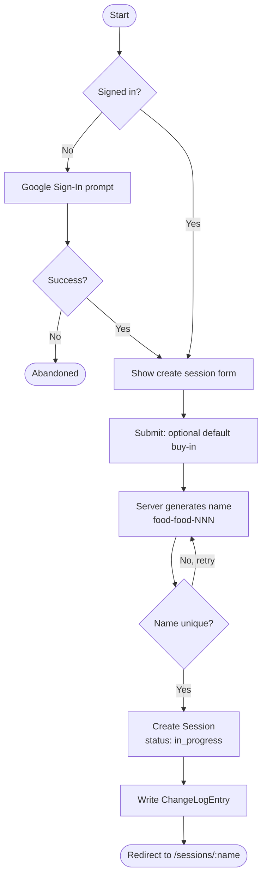
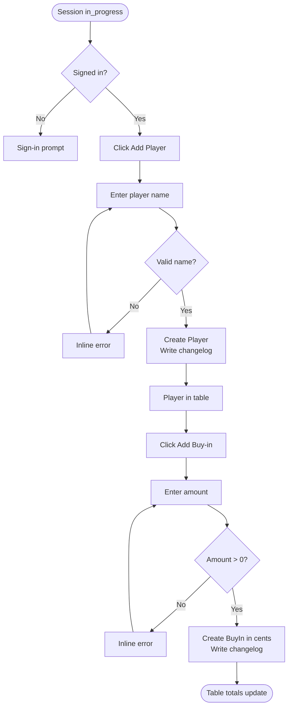
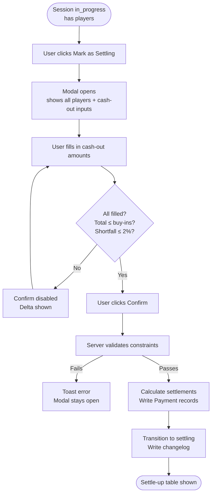
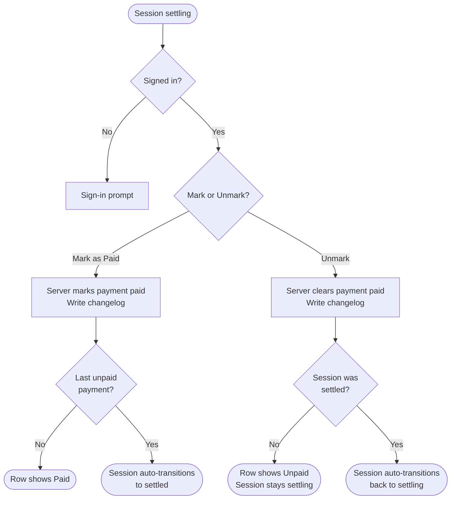

# 01 — User Flows

> Status: Draft — fill this before Phase 1 begins.

## Purpose

Define the primary user flows end-to-end. Each flow should be understandable without reading any code. Flows drive API design, data model decisions, and UX spec.

## Auth model summary

- **All access** (reads, mutations, search) requires Google Sign-In. Unauthenticated users are redirected to sign in, then redirected back to their original destination.
- **Players** are tracked by name only — they do not need a Google account. A signed-in user adds players by name on their behalf.

---

## Flow 1: Host Creates a Session

**Actor:** Signed-in user
**Precondition:** User is authenticated via Google Sign-In
**Steps:**
1. User clicks "New Session" in the side menu.
2. System presents a creation form: optional default buy-in amount (in dollars/cents).
3. User submits the form.
4. Server generates a unique session name (`food-food-NNN` format) and verifies it is unused.
5. Server creates the session in Firestore (`status: in_progress`) and writes a changelog entry.
6. User is redirected to `/sessions/:name`.

**Success outcome:** Session created; user lands on the session page with an empty player table.
**Failure cases:** Name collision (server retries silently, up to 5 times); invalid default buy-in (validation error shown inline).
**Auth required:** Yes.
**Data touched:** Creates `Session`, writes `ChangeLogEntry`.

_Flow 1: Host creates a session — happy path and silent retry on name collision._

---

## Flow 2: Operator Adds a Player and Records Buy-ins

**Actor:** Signed-in user (any Google-authenticated visitor to the session)
**Precondition:** Session exists and is `in_progress`
**Steps:**
1. User clicks "Add Player."
2. Modal prompts for player name (free text, 1–50 chars).
3. Server validates: non-empty, unique within session (case-insensitive).
4. Server creates Player record and writes changelog entry. Player appears in the table.
5. If a default buy-in was set, the player's first buy-in is pre-populated (user can confirm or change).
6. User clicks "Add Buy-in" on a player row.
7. User enters amount (dollars and cents, e.g., $0.25).
8. Server converts to cents, validates (> 0), creates BuyIn record, writes changelog entry.
9. Table updates with the new buy-in and revised totals.

**Success outcome:** Player visible in table with buy-in history and running total.
**Failure cases:** Duplicate player name (inline error); invalid amount (inline error); session not `in_progress` (error toast).
**Auth required:** Yes.
**Data touched:** Creates `Player`, creates `BuyIn`, writes `ChangeLogEntry` per action.

_Flow 2: Add player and record buy-in — happy path._

---

## Flow 3: Operator Moves Session to Settling

**Actor:** Signed-in user
**Precondition:** Session is `in_progress` and has at least one player
**Steps:**
1. User clicks "Mark as Settling." The button is always enabled when the session has players.
2. A modal opens showing all players with two columns: their total buy-in and a cash-out input field (prefilled with any previously entered value).
3. User fills in / confirms cash-out amounts for all players. The delta indicator in the modal updates in real time.
4. The modal's "Confirm" button is disabled until: all cash-out fields are filled, total cash-outs ≤ total buy-ins, and the shortfall is ≤ 2% of total buy-ins.
5. User clicks "Confirm."
6. Server re-validates both balance constraints.
7. Server calculates minimum settlement transactions (greedy net-balance algorithm) and writes `Payment` documents.
8. Server transitions session to `settling` and writes changelog entry. All writes are in a single Firestore transaction.
9. Modal closes. The settle-up section is now shown with payment rows and "Mark as Paid" buttons.

**Success outcome:** Session is `settling`; settlement table shown; buy-ins are locked.
**Failure cases:** Validation fails in modal (Confirm button stays disabled); server re-validation fails due to stale client state (toast error, modal stays open).
**Auth required:** Yes.
**Data touched:** Writes `Payment` records, updates `Session.status`, writes `ChangeLogEntry`.

_Flow 3: Mark as settling — cash-outs entered in modal, balance validated before transition._

---

## Flow 4: Mark Payments as Paid → Auto-settle; Unmark → Auto-unsettle

**Actor:** Signed-in user
**Precondition:** Session is `settling` or `settled`

### Mark as paid path (session is `settling`)

1. User clicks "Mark as Paid" on a payment row.
2. Server marks payment paid (timestamp, actor uid/name) and writes changelog entry.
3. If unpaid payments remain: row updates to "Paid." Done.
4. If this was the last payment: session **immediately and automatically** transitions to `settled`. No confirmation dialog. All rows now show "Paid."

### Unmark path (session is `settling` or `settled`)

1. User clicks "Unmark" on a payment row that was previously marked paid.
2. Server clears the payment's paid status and writes changelog entry.
3. If session was `settling`: payment row returns to unpaid state. Session stays `settling`.
4. If session was `settled`: session **immediately and automatically** transitions back to `settling`. That payment row is now unpaid; all others retain their paid status.

**Auth required:** Yes.
**Data touched:** Updates `Payment.paid` (and related fields); conditionally updates `Session.status`; writes `ChangeLogEntry`.

_Flow 4: Payment marking is bidirectional — last mark auto-settles; any unmark from settled auto-unstettles._

---

## Notes

- All access requires Google Sign-In. Unauthenticated users are redirected to sign in, then returned to their original destination.
- **Sharing a session URL with a friend who lacks a Google account does not work** — they must sign in with Google before viewing.
- Players are not users. "Billy" is a name string in Firestore; Billy may have no Google account. The signed-in user who adds Billy's buy-in is the actor in the changelog.
- The changelog entry format: `[timestamp] [actor first name] [action]`. E.g., `"Michi added **$50.00** buy-in for Billy."` Monetary amounts are wrapped in `**...**` markers and rendered bold by the activity log component. The actor's first name is `displayName.split(' ')[0]`, falling back to the literal string `"Anonymous"` if missing — **never** email or UID.
- Cash-outs are editable **only during `in_progress`**, in two places: (a) the player table during `in_progress`, and (b) the settling modal at the moment of transition. Once the session is `settling` or `settled`, cash-outs are locked. To change one, roll back to `in_progress` first.

## Related docs

- `02-domain-model.md`
- `06-api-contract.md`
- `08-ux-spec.md`
