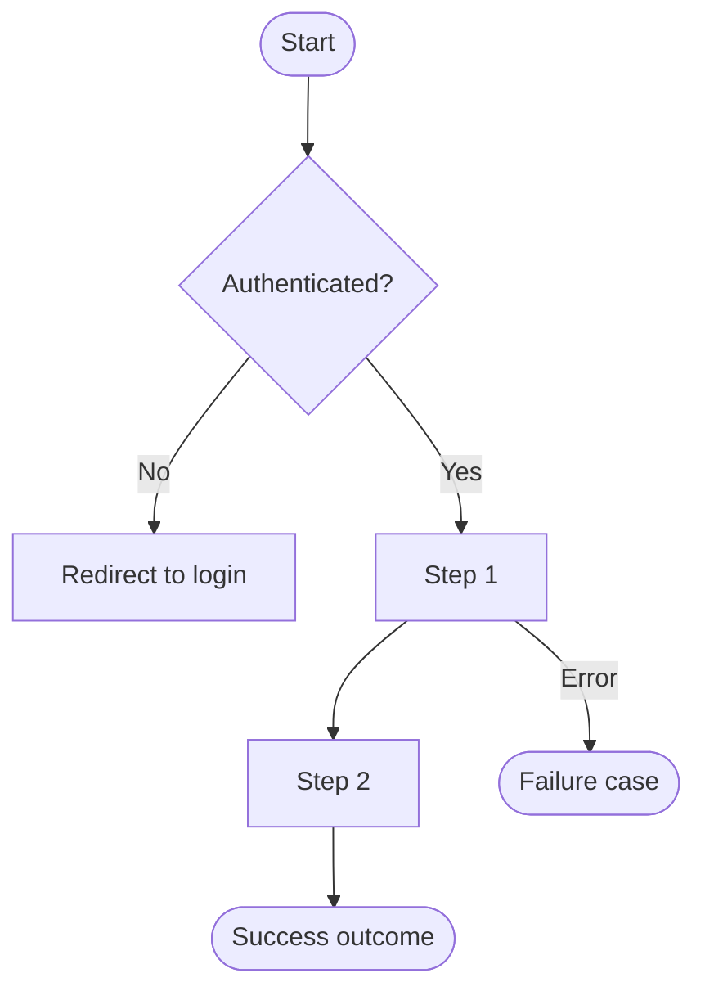

# 01 — User Flows

> Status: Draft — fill this before Phase 1 begins.

## Purpose

Define the primary user flows end-to-end. Each flow should be understandable without reading any code. Flows drive API design, data model decisions, and UX spec.

## Conventions

- Name flows clearly: `[Actor] [Action] [Outcome]`
- Call out decision points and alternate paths
- Call out authentication/authorization requirements per step
- Call out data reads and writes per step

---

## Flow 1: [Name]

**Actor:**
**Precondition:**
**Steps:**
1. ...
2. ...

**Success outcome:**
**Failure cases:**
**Auth required:** Yes / No
**Data touched:**

_Flow 1: [Name] — happy path and primary failure case._

---

## Flow 2: [Name]

<!-- Repeat pattern — copy the flowchart block and adapt it. -->

---

## Notes

<!-- Anything that doesn't fit cleanly into a flow but needs to be captured. -->

## Related docs

- `02-domain-model.md`
- `06-api-contract.md`
- `08-ux-spec.md`
