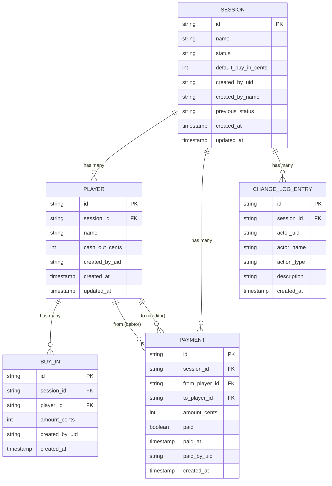

# 02 — Domain Model

> Status: Draft — fill this before Phase 1 begins.

## Purpose

Define the core entities, their attributes, and their relationships. This doc drives the data model, API design, and business logic. Keep it language-agnostic — this is about concepts, not implementation.

---

## Core entities

### Session

The root entity. Represents a single poker game from creation through settlement.

| Attribute | Type | Notes |
|---|---|---|
| id | string | Equals `name` — the URL slug (e.g., `crispy-salmon-042`) |
| name | string | Generated server-side: `food-food-NNN` format; globally unique |
| status | enum | `in_progress` \| `settling` \| `settled` \| `archived` |
| default_buy_in_cents | integer \| null | Optional default applied when a player is added |
| created_by_uid | string | Firebase Auth UID of the creator |
| created_by_name | string | First name only at creation time — `displayName.split(' ')[0]` |
| previous_status | enum \| null | Status before archiving; set on archive, cleared on unarchive |
| created_at | timestamp | |
| updated_at | timestamp | |

**Relationships:**
- Has many `Player` records
- Has many `Payment` records (generated when transitioning to `settling`)
- Has many `ChangeLogEntry` records

**Invariants:**
- `name` is immutable after creation.
- `status` follows the allowed state machine (see `07-business-logic.md`).
- A session with no players cannot transition to `settling`.
- `default_buy_in_cents` must be null or a positive integer.

---

### Player

A named participant in a session. Not tied to a Firebase Auth account — anyone can be added by name.

| Attribute | Type | Notes |
|---|---|---|
| id | string | Server-generated UUID |
| session_id | string | Foreign key to Session |
| name | string | Display name (e.g., "Billy"); 1–50 chars; unique within session (case-insensitive) |
| cash_out_cents | integer \| null | Final cash-out amount; null until set |
| created_by_uid | string | Firebase Auth UID of whoever added this player |
| created_at | timestamp | |
| updated_at | timestamp | |

**Relationships:**
- Belongs to one `Session`
- Has many `BuyIn` records
- Referenced by `Payment` records (as debtor or creditor)

**Invariants:**
- `name` must be unique within the session (case-insensitive after trimming).
- `cash_out_cents` must be null or a non-negative integer.
- Players cannot be added once the session is `settling` or `settled`.

---

### BuyIn

A single buy-in event for a player. A player may have multiple buy-ins during a session.

| Attribute | Type | Notes |
|---|---|---|
| id | string | Server-generated UUID |
| session_id | string | Foreign key to Session (denormalized for query convenience) |
| player_id | string | Foreign key to Player |
| amount_cents | integer | Positive integer; e.g., 25 = $0.25 |
| created_by_uid | string | Firebase Auth UID of whoever recorded this buy-in |
| created_at | timestamp | |

**Relationships:**
- Belongs to one `Player`
- Belongs to one `Session`

**Invariants:**
- `amount_cents` must be a positive integer (> 0).
- Buy-ins cannot be added or removed once the session is `settling` or `settled`.
- Buy-ins are not modified — they are removed and recreated to correct mistakes.

---

### Payment

A calculated debt between two players. Generated when a session transitions to `settling`. Represents the minimum set of transactions to settle all net balances.

| Attribute | Type | Notes |
|---|---|---|
| id | string | Server-generated UUID |
| session_id | string | Foreign key to Session |
| from_player_id | string | The debtor (owes money) |
| to_player_id | string | The creditor (is owed money) |
| amount_cents | integer | Positive integer |
| paid | boolean | Whether this payment has been marked paid |
| paid_at | timestamp \| null | When it was marked paid |
| paid_by_uid | string \| null | Firebase Auth UID of whoever marked it paid |
| created_at | timestamp | When the settlement was calculated |

**Relationships:**
- Belongs to one `Session`
- References two `Player` records

**Invariants:**
- `amount_cents` must be a positive integer.
- `paid` can be toggled. Marking paid is idempotent (no-op if already paid).
- When a payment is un-marked while the session is `settled`, the session auto-transitions to `settling`.
- When manually rolling back `settled → settling`, all `paid` fields are reset to false.
- When rolling back `settling → in_progress`, payment records are retained but ignored; recalculated on re-entry to `settling`.
- Payment records are never deleted.

---

### ChangeLogEntry

An immutable record of every state-changing action. Append-only.

| Attribute | Type | Notes |
|---|---|---|
| id | string | Server-generated UUID |
| session_id | string | Foreign key to Session |
| actor_uid | string | Firebase Auth UID of the signed-in user who performed the action |
| actor_name | string | First name only at action time — `displayName.split(' ')[0]`; never email or full name |
| action_type | enum | `session_created`, `player_added`, `player_name_edited`, `buy_in_added`, `buy_in_removed`, `cash_out_set`, `status_changed`, `payment_marked_paid`, `payment_unmarked_paid` |
| description | string | Human-readable summary (e.g., "Michi added $50.00 buy-in for Billy") |
| created_at | timestamp | |

**Relationships:**
- Belongs to one `Session`

**Invariants:**
- Immutable after creation — never updated or deleted.
- Written atomically with the primary mutation it describes.
- Every state-changing write must produce exactly one `ChangeLogEntry`.

---

## Relationships diagram

_Entity relationship overview — update when entities or relationships change._

---

## Key business rules

- A `Player`'s total buy-in = sum of all their `BuyIn.amount_cents`.
- A `Player`'s net balance = `cash_out_cents` − total buy-in. Positive = won money. Negative = lost money.
- `Payment` records are derived from net balances using the minimum-transaction algorithm. They are calculated at settling time and stored.
- `ChangeLogEntry` records are written atomically with every mutation — there are no silent writes.
- Users (Firebase Auth) are not stored as a Firestore entity. Their uid and display name are denormalized into records that need attribution.

## Related docs

- `05-data-model.md` — Firestore-specific representation
- `07-business-logic.md` — rules that govern entity behavior
