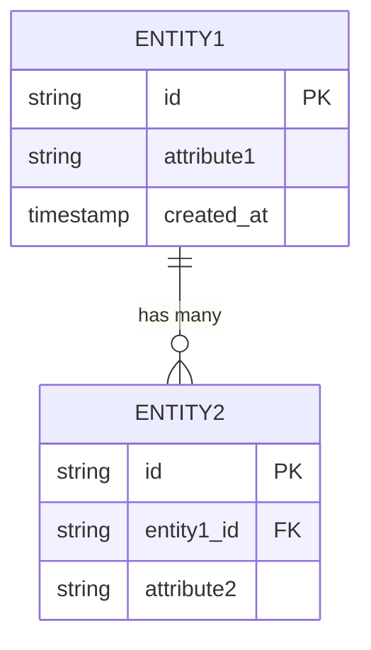

# 02 — Domain Model

> Status: Draft — fill this before Phase 1 begins.

## Purpose

Define the core entities, their attributes, and their relationships. This doc drives the data model, API design, and business logic. Keep it language-agnostic — this is about concepts, not implementation.

---

## Core entities

### [Entity 1]

| Attribute | Type | Notes |
|---|---|---|
| id | string | |
| ... | | |

**Relationships:**
- belongs to / has many / etc.

**Invariants:**
- Rules that must always be true for this entity.

---

### [Entity 2]

<!-- Repeat pattern -->

---

## Relationships diagram

_Entity relationship overview — update when entities or relationships change._

## Key business rules

<!-- Rules that cut across entities. E.g., "a user can only have one active session per device." -->

## Related docs

- `05-data-model.md` — database representation
- `07-business-logic.md` — rules that govern entity behavior
