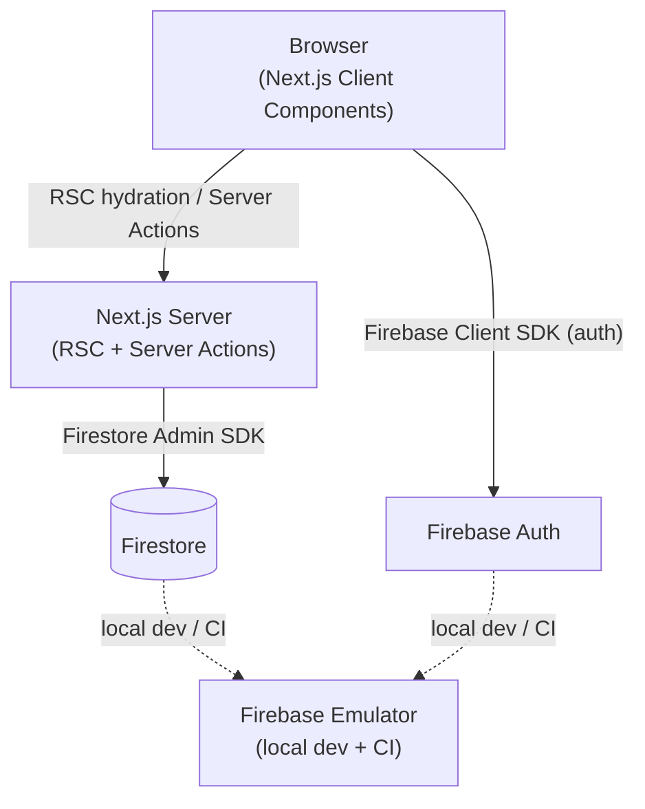

# 03 — Architecture

> Status: Draft — fill this before Phase 1 begins.

## Purpose

Define the high-level technical architecture: layers, components, and how they interact. Decisions here should be backed by ADRs.

---

## System overview

Poker Ledger is a Next.js 15 App Router application hosted on Vercel. All application logic lives in a single Next.js app — there is no separate backend service. The database is Firestore (Firebase). Firebase Auth (Google Sign-In) gates all access — reads and mutations alike — enforced by Next.js middleware. The UI uses Tailwind CSS and shadcn/ui.

The app is read-heavy with low write volume. Session state changes (buy-ins, cash-outs, payments) are infrequent relative to reads.

## Tech stack

| Layer | Choice | Rationale |
|---|---|---|
| Framework | Next.js 15 (App Router) | Full-stack, Vercel-native, RSC + Server Actions |
| Language | TypeScript (strict) | End-to-end type safety |
| Hosting | Vercel | Zero-config CI/CD, preview deployments per branch |
| Database | Firestore (Firebase) | Document model fits session/player structure; Firebase emulator for local dev |
| Auth | Firebase Auth (Google Sign-In) | Native Firestore integration; Google Sign-In required for all access |
| Styling | Tailwind CSS + shadcn/ui | Utility-first with accessible, composable components |
| Lint/Format | Biome | Single tool for lint + format; fast; replaces ESLint + Prettier |
| Unit/Integration Tests | Vitest + Testing Library | Fast, ESM-native; co-located test files |
| E2E Tests | Playwright | Cross-browser; reliable async testing |
| Git hooks | Lefthook | Pre-commit: typecheck + lint + unit tests |
| CI | GitHub Actions | Runs all gates on every PR push |

## Component diagram

_High-level component diagram — update when architectural boundaries change._

## Key architectural decisions

ADRs accepted:

- [x] `specs/decisions/0001-use-vercel-for-hosting.md` — Vercel for hosting and preview deployments
- [x] `specs/decisions/0002-use-firestore.md` — Firestore as the document database
- [x] `specs/decisions/0003-auth-model.md` — Google Sign-In required for all access; first-name-only changelog attribution
- [x] `specs/decisions/0004-server-actions-over-api-routes.md` — Mutations via Server Actions; RSC for reads; thin API route for search
- [x] `specs/decisions/0005-monetary-amounts-as-integer-cents.md` — All monetary amounts stored as integer cents

## Data flow

**Read (session view):**
1. Client navigates to `/sessions/:name`
2. Next.js middleware verifies Firebase ID token — unauthenticated requests are redirected to sign-in
3. Next.js RSC fetches session + players + buy-ins from Firestore server-side
4. Server renders HTML; client receives hydrated component tree

**Write (buy-in, cash-out, payment, state change):**
1. User triggers action in the UI
2. Client invokes a Next.js Server Action
3. Server Action validates input and enforces business rules
4. Server Action writes to Firestore via Admin SDK
5. Response updates client UI

All mutations go through Server Actions — client components do not write to Firestore directly.

## Boundaries and integrations

- **Firestore**: primary data store — all reads and writes
- **Firebase Auth**: user identity (scope TBD)
- **Vercel**: hosting, preview deployments, environment variable management
- No external payment integrations, no webhooks, no email or push notifications

## Security boundaries

- **Next.js middleware** enforces the auth gate universally — all routes (reads and mutations) require a valid Firebase ID token. Unauthenticated requests are redirected to sign in.
- **Server Actions** (mutations) additionally verify the Firebase ID token passed explicitly from the client via the Firebase Admin SDK.
- **Firestore Security Rules** enforce `request.auth != null` for all reads and writes — second line of defense at the database layer.
- Firebase config vars (`NEXT_PUBLIC_FIREBASE_*`) are public by design — they identify the project, not authorize access.
- Firebase Admin SDK credentials (`FIREBASE_ADMIN_*`) are server-only and never bundled to the client.
- User input is never trusted — validated on the server before any Firestore write.
- Changelog entries store only the actor's first name (`displayName.split(' ')[0]`) — never the full display name or email.

## Scalability and constraints

- Firestore free tier: 50K reads/day, 20K writes/day, 1GB storage — adequate for MVP
- Session data is bounded: small, fixed number of players and buy-ins per session
- No background jobs or queues required for MVP
- Known limit: Firestore writes are bounded to ~1 write/second per document; concurrent edits to the same session could contention. Acceptable for MVP (small groups, low frequency)
- Vercel Fluid Compute scales automatically if traffic grows

## Related docs

- `04-security-threat-model.md`
- `05-data-model.md`
- `06-api-contract.md`
- `10-deployment-ops.md`
