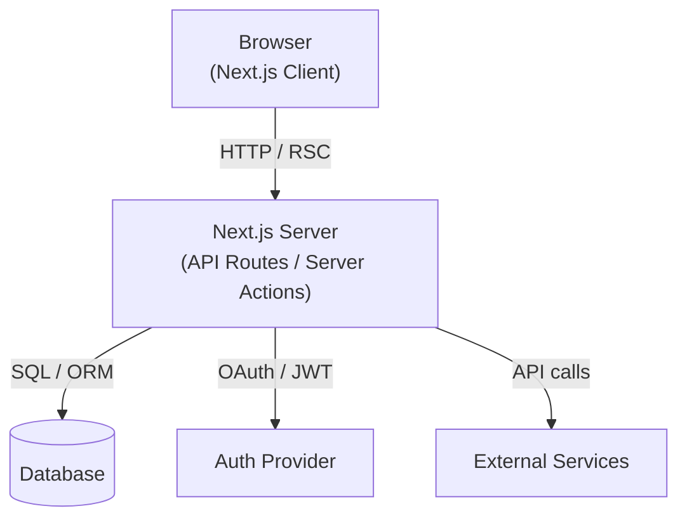

# 03 — Architecture

> Status: Draft — fill this before Phase 1 begins.

## Purpose

Define the high-level technical architecture: layers, components, and how they interact. Decisions here should be backed by ADRs.

---

## System overview

<!-- Describe the system at a high level. What are the main parts? -->

## Tech stack

| Layer | Choice | Rationale |
|---|---|---|
| Framework | | |
| Language | TypeScript | |
| Hosting | Vercel | |
| Database | | |
| Auth | | |
| Styling | | |
| Testing | | |

## Component diagram

_High-level component diagram — update when architectural boundaries change._

## Key architectural decisions

<!-- List durable decisions. Each should link to an ADR. -->

- [ ] `specs/decisions/0001-*.md` — [decision name]

## Data flow

<!-- Describe the primary data flows: user request → response path. -->

## Boundaries and integrations

<!-- External services, third-party APIs, webhooks, etc. -->

## Security boundaries

<!-- Where are the trust boundaries? What enters from untrusted sources? -->

## Scalability and constraints

<!-- Known limits. What will break first under load? -->

## Related docs

- `04-security-threat-model.md`
- `05-data-model.md`
- `06-api-contract.md`
- `10-deployment-ops.md`
