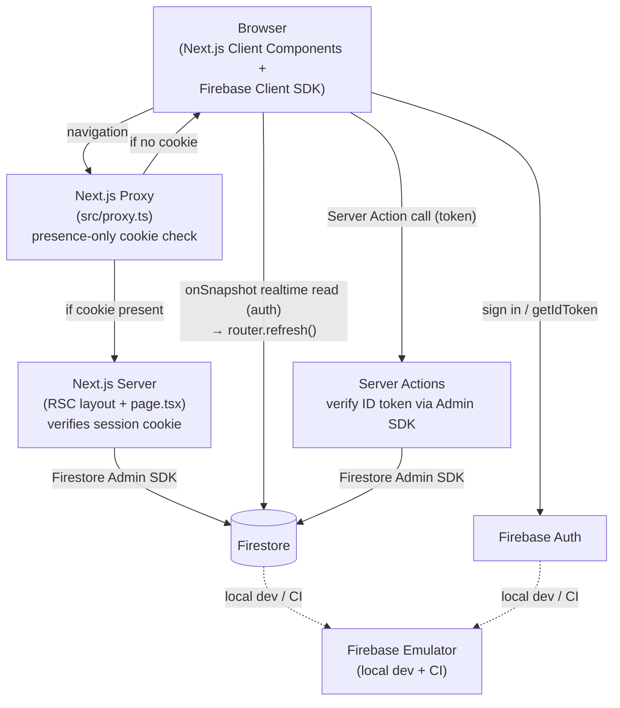

# 03 — Architecture

> Status: Draft — fill this before Phase 1 begins.

## Purpose

Define the high-level technical architecture: layers, components, and how they interact. Decisions here should be backed by ADRs.

---

## System overview

Poker Ledger is a Next.js 16 App Router application hosted on Vercel. All application logic lives in a single Next.js app — there is no separate backend service. The database is Firestore (Firebase). Firebase Auth (Google Sign-In) gates all access — reads and mutations alike — enforced by the Next.js proxy (`src/proxy.ts`, formerly known as middleware in Next.js ≤15) plus per-request verification at the layout/RSC level for reads and inside Server Actions for mutations. The UI uses Tailwind CSS and shadcn/ui.

The app is read-heavy with low write volume. Session state changes (buy-ins, cash-outs, payments) are infrequent relative to reads.

> **Note on terminology:** Next.js 16 renamed the `middleware.ts` file to `proxy.ts`. This doc uses **"proxy"** throughout. Older specs (e.g., `0002-firebase-auth.md`) refer to "middleware"; that text predates the rename and should be read as referring to the same component.

## Tech stack

| Layer | Choice | Rationale |
|---|---|---|
| Framework | Next.js 16 (App Router) | Full-stack, Vercel-native, RSC + Server Actions |
| Language | TypeScript (strict) | End-to-end type safety |
| Hosting | Vercel | Zero-config CI/CD, preview deployments per branch |
| Database | Firestore (Firebase) | Document model fits session/player structure; Firebase emulator for local dev |
| Auth | Firebase Auth (Google Sign-In) | Native Firestore integration; Google Sign-In required for all access |
| Styling | Tailwind CSS v4 + shadcn/ui | Utility-first with accessible, composable components |
| Lint/Format | Biome | Single tool for lint + format; fast; replaces ESLint + Prettier |
| Unit/Integration Tests | Vitest + Testing Library | Fast, ESM-native; co-located test files |
| E2E Tests | Playwright | Cross-browser; reliable async testing |
| Git hooks | Lefthook | Pre-commit: typecheck + lint + unit tests |
| CI | GitHub Actions | Runs all gates on every PR push (deferred — see `docs/16` for current state) |

## Component diagram

_High-level component diagram — update when architectural boundaries change._

## Key architectural decisions

ADRs accepted:

- [x] `specs/decisions/0001-use-vercel-for-hosting.md` — Vercel for hosting and preview deployments
- [x] `specs/decisions/0002-use-firestore.md` — Firestore as the document database
- [x] `specs/decisions/0003-auth-model.md` — Google Sign-In required for all access; first-name-only changelog attribution
- [x] `specs/decisions/0004-server-actions-over-api-routes.md` — Mutations via Server Actions; RSC for reads; thin API route for search
- [x] `specs/decisions/0005-monetary-amounts-as-integer-cents.md` — All monetary amounts stored as integer cents

## Auth flow (canonical)

This is the authoritative description of how authentication is enforced. Other docs must defer to this.

1. **Sign-in (one-time)**
    - User clicks "Sign in with Google" in `src/app/sign-in/page.tsx`.
    - Firebase Client SDK (`signInWithPopup`) returns an ID token.
    - Client invokes `createSessionCookie(idToken)` Server Action.
    - Server Action verifies the ID token (`adminAuth.verifyIdToken`), creates a session cookie via `adminAuth.createSessionCookie(idToken, { expiresIn: 5 * 24 * 60 * 60 * 1000 })`, and sets it as `HttpOnly`, `Secure`, `SameSite=Strict`.
    - Client redirects to the originally requested page (or `/sessions`).

2. **Subsequent navigation (read paths)**
    - Browser sends the `session` cookie automatically.
    - **Proxy** (`src/proxy.ts`): checks for cookie presence only. If absent, redirect to `/sign-in?redirect=<original-path>`. If present, allow the request through. Cryptographic verification is NOT done here (the proxy runs in a constrained runtime and would add latency to every request). This is **defense-in-depth**, not the primary check.
    - **Layout** (`src/app/(app)/layout.tsx`): RSC calls `adminAuth.verifySessionCookie(cookie, true)` (the `true` enables revocation check). On failure, redirect to `/sign-in`. This is the primary auth check for read paths.
    - The verified UID and `displayName` are passed down via React context or read fresh in each RSC page that needs them.

3. **Subsequent navigation (mutation paths — Server Actions)**
    - Each mutation Server Action accepts a `token: string` parameter.
    - The client obtains a fresh token via `auth.currentUser.getIdToken()` immediately before invoking the action. Firebase Client SDK auto-refreshes the underlying ID token (~1 hr TTL) using its persisted refresh token; this call is fast and does not hit the network in the common case.
    - The action calls `adminAuth.verifyIdToken(token, true)` — the `true` enables a revocation check, so tokens issued before `revokeRefreshTokens` was called for the user are rejected. On failure, returns `{ success: false, error: { code: "UNAUTHENTICATED" } }`.
    - The session cookie alone is NOT sufficient for mutations — a fresh ID token is required.

4. **Sign-out**
    - The `UserMenu` sign-out handler (`src/components/layout/user-menu.tsx`) first calls Firebase Client SDK `signOut(auth)` to clear `currentUser` and remove the refresh token from IndexedDB.
    - It then invokes the `signOut()` Server Action (`src/app/sign-in/actions.ts`), which:
        1. Reads the `session` cookie and decodes it via `adminAuth.verifySessionCookie(cookie, true)` to recover the user's `uid`.
        2. Calls `adminAuth.revokeRefreshTokens(uid)` so any refresh token that escaped the browser becomes unusable and ID tokens minted before this moment fail the `checkRevoked` step.
        3. Deletes the `session` cookie.
        4. Redirects to `/sign-in`.
    - Sign-out is idempotent: missing/invalid cookie or Admin SDK failure still clears the cookie and redirects — the user must end up signed out from their perspective.

5. **Cookie expiry / cross-tab sign-out**
    - Session cookie TTL is 5 days. After expiry, the user is redirected to `/sign-in` on next navigation.
    - If the user signs out in tab A, tab B's `session` cookie is gone and (because A revoked refresh tokens) tab B's in-memory ID token will be rejected on its next mutation. The client treats this as session-expired and redirects to `/sign-in?redirect=<current path>` with a "Session expired — please sign in again" toast.

## Data flow

**Read (session view):**
1. Client navigates to `/sessions/:name`.
2. Proxy (`src/proxy.ts`) checks for the `session` cookie. Missing → redirect to sign-in.
3. RSC layout (`src/app/(app)/layout.tsx`) verifies the cookie via `adminAuth.verifySessionCookie`. Failure → redirect.
4. RSC page (`src/app/(app)/sessions/[name]/page.tsx`) fetches session + players + buy-ins + payments + changelog from Firestore via Admin SDK.
5. Server renders HTML; client receives hydrated component tree.

**Background realtime sync (spec 0033):**
1. On the session detail page and the sessions index, a client Firestore `onSnapshot` listener watches for changes — the newest `change_log` entry for a session, or the `sessions` collection on the index — over the SDK's WebChannel (authenticated read; `firestore.rules` already permits it). This is the only place clients read Firestore directly rather than via the Admin SDK.
2. On a change it debounced-calls `router.refresh()`, re-running the RSC read path above so all server-side data shaping is reused (no client re-derivation). It is a soft refresh — scroll, focus, and open modals are preserved.
3. Syncing stops after 10 minutes of no interaction and resumes on interaction, tab refocus (`visibilitychange`), or reconnect with a single catch-up refresh. A connection light + stale banner reflect the state. See ADR 0010.

**Write (buy-in, cash-out, payment, state change):**
1. User triggers action in the UI.
2. Client component calls `auth.currentUser.getIdToken()` to obtain a fresh ID token.
3. Client invokes the Server Action with the token + payload.
4. Server Action verifies the ID token (`adminAuth.verifyIdToken`).
5. Server Action validates input, enforces business rules (see `docs/07-business-logic.md`), and writes to Firestore via Admin SDK (batched write or transaction per the rules in `07`).
6. Action returns a typed `ActionResult`. Client updates UI (revalidate path or optimistic update).

All mutations go through Server Actions — client components do not write to Firestore directly.

## Boundaries and integrations

- **Firestore**: primary data store — all reads and writes.
- **Firebase Auth**: user identity. Google Sign-In is the only enabled provider.
- **Vercel**: hosting, preview deployments, environment variable management.
- No external payment integrations, no webhooks, no email, no push notifications.

## Security boundaries

- **Proxy** (`src/proxy.ts`): presence-only cookie check at the edge. Defense-in-depth, not the primary auth gate.
- **App layout RSC**: cryptographically verifies the session cookie via `adminAuth.verifySessionCookie` on every read request. Failure → redirect to sign-in.
- **Server Actions**: cryptographically verify a fresh Firebase ID token (passed explicitly by the client) on every mutation. Session cookie alone is not sufficient for mutations.
- **Firestore Security Rules**: `request.auth != null` for reads. Reads now come from two paths — the Admin SDK (RSC render) and, since spec 0033, direct client `onSnapshot` listeners for background realtime sync — and the rules require auth for both. All writes are denied to clients — writes always flow through Server Actions using the Admin SDK, which bypasses rules.
- Firebase config vars (`NEXT_PUBLIC_FIREBASE_*`) are public by design — they identify the project, not authorize access.
- Firebase Admin SDK credentials (`FIREBASE_ADMIN_*`) are server-only and never bundled to the client.
- User input is never trusted — validated on the server before any Firestore write.
- Changelog entries store only the actor's first name (`displayName.split(' ')[0]`, fallback `"Anonymous"`) — never the full display name or email.

## Scalability and constraints

- Firestore free tier: 50K reads/day, 20K writes/day, 1GB storage — adequate for MVP.
- Session data is bounded: small, fixed number of players and buy-ins per session.
- No background jobs or queues required for MVP.
- Concurrent edits to the same session are handled by Firestore transactions for high-stakes mutations (transition-to-settling, mark/unmark payment) — see "Concurrency and optimistic locking" in `docs/07-business-logic.md`. Other mutations use batched writes and are last-write-wins; the small group / low-frequency usage pattern makes lost-update bugs unlikely in practice.
- Firestore writes are bounded to ~1 write/second per document; not a concern at MVP scale.
- Vercel Fluid Compute scales automatically if traffic grows.

### Known limitations (deferred)

- **Rate limiting**: no rate-limiting on session creation or sign-in. A scripted attacker could exhaust the Firestore name keyspace or hit auth quota. Mitigations to consider post-MVP: Firebase App Check, Vercel BotID, Cloud Functions throttle.
- **Hard delete**: archive is soft-delete only. No GDPR delete automation. Manual deletion procedure documented in `docs/05-data-model.md` → "Hard delete (manual)".
- **Pagination at scale**: index page does client-side pagination over up to 200 fetched sessions. Beyond 200 visible sessions, server-side cursor pagination is required.

## Related docs

- `04-security-threat-model.md`
- `05-data-model.md`
- `06-api-contract.md`
- `10-deployment-ops.md`
