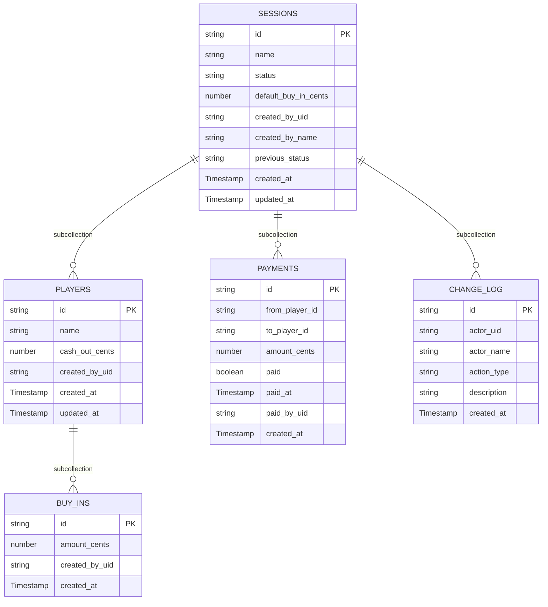

# 05 — Data Model

> Status: Draft — fill this before Phase 1 begins.

## Purpose

Define the database schema, indexes, constraints, and migration strategy. Driven by the domain model but adds persistence-specific concerns.

---

## Database choice

**Firestore** (Firebase) — NoSQL document database.
ADR reference: `specs/decisions/0002-use-firestore.md` (to be written)

Rationale: document model maps naturally to session/player/buy-in hierarchy; Firebase emulator enables fully local development; integrates natively with Firebase Auth.

---

## Collection structure

Firestore uses a collection/document/subcollection hierarchy. All writes within a session use batch writes or transactions to ensure atomicity (primary write + changelog entry together).

```
sessions/{sessionId}
  players/{playerId}
    buy_ins/{buyInId}
  payments/{paymentId}
  change_log/{entryId}
```

---

## Schema

### Collection: `sessions`

Document ID = session name (e.g., `crispy-salmon-042`) — serves as the URL slug.

| Field | Type | Nullable | Notes |
|---|---|---|---|
| `name` | `string` | No | Equals document ID |
| `status` | `string` | No | `in_progress` \| `settling` \| `settled` \| `archived` |
| `default_buy_in_cents` | `number` | Yes | Positive integer or null |
| `created_by_uid` | `string` | No | Firebase Auth UID |
| `created_by_name` | `string` | No | Denormalized display name at creation |
| `previous_status` | `string` | Yes | Status before archiving; set on archive, cleared on unarchive |
| `created_at` | `Timestamp` | No | |
| `updated_at` | `Timestamp` | No | Updated on every status change |

**Indexes:**
- Default: `sessions` collection group (for index page queries)
- Composite: `(status ASC, created_at DESC)` — for index page ordering by status then recency
- Single field: `name` — for search/autocomplete queries (prefix matching via `>=`/`<` range query)

---

### Subcollection: `sessions/{sessionId}/players`

| Field | Type | Nullable | Notes |
|---|---|---|---|
| `name` | `string` | No | 1–50 chars; trimmed; unique within session (enforced server-side) |
| `cash_out_cents` | `number` | Yes | Non-negative integer or null |
| `created_by_uid` | `string` | No | Firebase Auth UID |
| `created_at` | `Timestamp` | No | |
| `updated_at` | `Timestamp` | No | Updated when cash_out_cents changes |

**Indexes:**
- Default: `created_at ASC` (player table display order)

---

### Subcollection: `sessions/{sessionId}/players/{playerId}/buy_ins`

| Field | Type | Nullable | Notes |
|---|---|---|---|
| `amount_cents` | `number` | No | Positive integer |
| `created_by_uid` | `string` | No | Firebase Auth UID |
| `created_at` | `Timestamp` | No | |

**Indexes:**
- Default: `created_at ASC` (chronological buy-in history)

---

### Subcollection: `sessions/{sessionId}/payments`

Generated when a session transitions to `settling`. One document per minimum-transaction payment.

| Field | Type | Nullable | Notes |
|---|---|---|---|
| `from_player_id` | `string` | No | Debtor player document ID |
| `to_player_id` | `string` | No | Creditor player document ID |
| `amount_cents` | `number` | No | Positive integer |
| `paid` | `boolean` | No | Default: `false` |
| `paid_at` | `Timestamp` | Yes | Set when marked paid |
| `paid_by_uid` | `string` | Yes | Firebase Auth UID of who marked it |
| `created_at` | `Timestamp` | No | When settlement was calculated |

**Indexes:**
- Default: `created_at ASC`

---

### Subcollection: `sessions/{sessionId}/change_log`

Append-only. Never updated or deleted.

| Field | Type | Nullable | Notes |
|---|---|---|---|
| `actor_uid` | `string` | No | Firebase Auth UID |
| `actor_name` | `string` | No | Denormalized display name at action time |
| `action_type` | `string` | No | Enum: see below |
| `description` | `string` | No | Human-readable (e.g., "Michi added $50.00 buy-in for Billy") |
| `created_at` | `Timestamp` | No | |

**`action_type` values:**
- `session_created`
- `player_added`
- `player_name_edited`
- `buy_in_added`
- `buy_in_removed`
- `cash_out_set`
- `status_changed` (covers all state transitions: in_progress↔settling↔settled, archive, unarchive)
- `payment_marked_paid`
- `payment_unmarked_paid`

**Indexes:**
- Default: `created_at DESC` (most recent first in UI)

---

## Schema diagram


_Firestore collection hierarchy — subcollections shown as relationships._

---

## Relationships and embedding decisions

- **Players as subcollection** (not embedded in Session document): players can have many buy-ins; embedding would make the session document unbounded in size.
- **Buy-ins as subcollection of players**: scoped to player, naturally queryable per player.
- **Payments as subcollection of session** (not of player): payments involve two players; session-level is the right scope.
- **Change log as subcollection of session**: all activity is session-scoped; append-only; queried chronologically.
- **No separate `users` collection**: Firebase Auth is the source of truth for user identity. Display names are denormalized at write time.

---

## Atomicity strategy

Every mutation consists of at minimum two writes: the primary record change + a `ChangeLogEntry`. These must be atomic. Use Firestore **batched writes** or **transactions**:

- Simple creates/updates with a single document change: use a batch write (primary + changelog).
- State transitions that also create/update multiple records (e.g., creating Payment documents on settling): use a Firestore **transaction** to read-then-write safely.

---

## Migration strategy

Firestore is schemaless. There are no migrations in the SQL sense. Schema evolution is managed by:

1. **Additive changes** (new fields): add the field server-side with a default; old documents without the field are handled by null-checking in application code.
2. **Renaming/removing fields**: requires a backfill script — document the backfill plan in the change spec.
3. **Breaking changes**: document in an ADR; backfill before deploying the change.

No automated migration runner — backfills are manual scripts run before deploying the relevant change.

---

## Sensitive data handling

- **Financial amounts**: stored as integer cents — not classified as PII, but sensitive within a friend group.
- **User identity**: `actor_uid` (Firebase UID) and `actor_name` (Google display name) are stored in changelog entries. This is personal data. For MVP, no special encryption beyond Firestore at-rest encryption.
- No payment card data, no bank details, no full legal names.

---

## Data retention and deletion

- Sessions are soft-deleted to `archived` state — no hard deletion in MVP.
- No automated data retention policy for MVP.
- If a user requests deletion: manual process — delete the session document and all subcollections. (No GDPR automation in MVP — document as a known limitation.)

---

## Related docs

- `02-domain-model.md`
- `04-security-threat-model.md`
- `06-api-contract.md`
