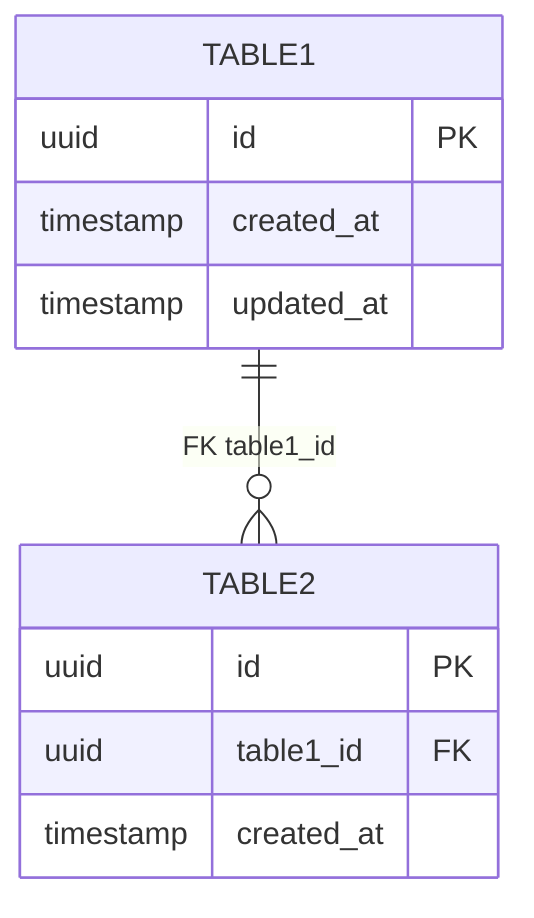

# 05 — Data Model

> Status: Draft — fill this before Phase 1 begins.

## Purpose

Define the database schema, indexes, constraints, and migration strategy. Drives by the domain model but adds persistence-specific concerns.

---

## Database choice

<!-- Which database? SQL/NoSQL? Hosted where? ADR reference: -->

## Schema

### Table/Collection: [name]

| Column/Field | Type | Nullable | Default | Notes |
|---|---|---|---|---|
| id | | | | Primary key |
| created_at | | | now() | |
| updated_at | | | now() | |

**Indexes:**
- Primary: `id`
- Additional: ...

**Constraints:**
- ...

---

## Schema diagram

_Schema ER diagram — keep in sync with the schema section above. Update after every migration._

## Relationships

<!-- Describe foreign keys, references, or embedding decisions and why. -->

## Migration strategy

<!-- How are schema changes applied? Who runs migrations? How are rollbacks handled? -->

## Sensitive data handling

<!-- PII, financial data, secrets. Where stored, how encrypted, access controls. -->

## Data retention and deletion

<!-- What data is kept? For how long? How is deletion handled (GDPR, etc.)? -->

## Related docs

- `02-domain-model.md`
- `04-security-threat-model.md`
- `06-api-contract.md`
