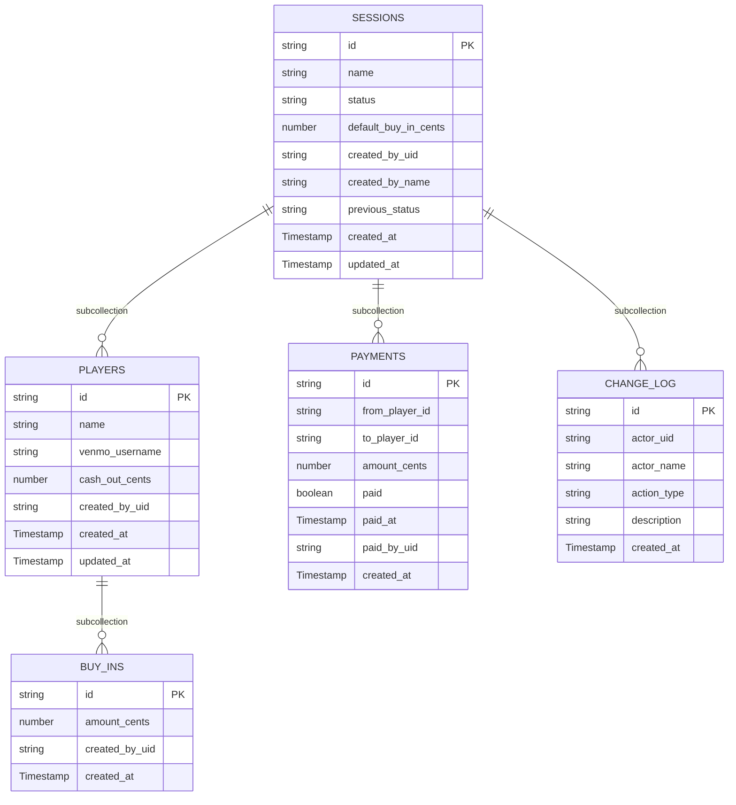

# 05 — Data Model

> Status: Draft — fill this before Phase 1 begins.

## Purpose

Define the database schema, indexes, constraints, and migration strategy. Driven by the domain model but adds persistence-specific concerns.

---

## Database choice

**Firestore** (Firebase) — NoSQL document database.
ADR reference: `specs/decisions/0002-use-firestore.md` (to be written)

Rationale: document model maps naturally to session/player/buy-in hierarchy; Firebase emulator enables fully local development; integrates natively with Firebase Auth.

---

## Collection structure

Firestore uses a collection/document/subcollection hierarchy. All writes within a session use batch writes or transactions to ensure atomicity (primary write + changelog entry together).

```
sessions/{sessionId}
  players/{playerId}
    buy_ins/{buyInId}
  payments/{paymentId}
  change_log/{entryId}
```

---

## Schema

### Collection: `sessions`

Document ID = session name (e.g., `crispy-salmon-042`) — serves as the URL slug.

| Field | Type | Nullable | Notes |
|---|---|---|---|
| `name` | `string` | No | Equals document ID |
| `name_lower` | `string` | No | Lowercased copy of `name` for case-insensitive search/autocomplete |
| `status` | `string` | No | `in_progress` \| `settling` \| `settled` \| `archived` |
| `default_buy_in_cents` | `number` | Yes | Positive integer or null. Used as the prefilled buy-in for newly-added players. |
| `player_count` | `number` | No | Denormalized count, updated atomically on `addPlayer`. Avoids N+1 on the index page. Default 0. |
| `created_by_uid` | `string` | No | Firebase Auth UID |
| `created_by_name` | `string` | No | First name only at creation — see `actor_name` rule in `change_log` |
| `previous_status` | `string` | Yes | Status before archiving. **Invariant:** if `status === "archived"` then `previous_status` MUST be a non-null valid recoverable state (`in_progress`, `settling`, or `settled`). Cleared on unarchive. |
| `created_at` | `Timestamp` | No | |
| `updated_at` | `Timestamp` | No | Updated on every mutation |

**Indexes:**
- Default: `sessions` collection group (for index page queries)
- Composite: `(status ASC, created_at DESC)` — for index page ordering by status then recency. Required for production. Locally, the emulator auto-creates indexes on first query.
- Single field: `name_lower` — for case-insensitive search/autocomplete queries (prefix matching via `>=`/`<` range query). Stored alongside `name`.

**Index file:** all required composite indexes are declared in `firestore.indexes.json` at the repo root. Firestore CLI deploys this file with `firebase deploy --only firestore:indexes`. The emulator reads the same file but is more permissive.

---

### Subcollection: `sessions/{sessionId}/players`

| Field | Type | Nullable | Notes |
|---|---|---|---|
| `name` | `string` | No | 1–50 chars; trimmed; unique within session (case-insensitive) |
| `name_lower` | `string` | No | Lowercased + trimmed copy of `name`; denormalized for case-insensitive uniqueness query |
| `venmo_username` | `string` | Yes | Optional Venmo handle (canonical form, no leading `@`); 5–30 chars matching `[A-Za-z0-9_.-]`; null when unset |
| `cash_out_cents` | `number` | Yes | Non-negative integer or null |
| `created_by_uid` | `string` | No | Firebase Auth UID |
| `created_at` | `Timestamp` | No | |
| `updated_at` | `Timestamp` | No | Updated when `name`, `name_lower`, `venmo_username`, or `cash_out_cents` changes |

**Uniqueness:** enforced inside a Firestore transaction by querying `players` for `name_lower == <new_name_lower>` before write. Firestore cannot do case-insensitive equality on `name` directly; the `name_lower` denormalization is the workaround.

**Indexes:**
- Default: `created_at ASC` (player table display order)
- Single field: `name_lower` (auto-created — used for uniqueness check)

---

### Subcollection: `sessions/{sessionId}/players/{playerId}/buy_ins`

| Field | Type | Nullable | Notes |
|---|---|---|---|
| `amount_cents` | `number` | No | Positive integer |
| `created_by_uid` | `string` | No | Firebase Auth UID |
| `created_at` | `Timestamp` | No | |

**Indexes:**
- Default: `created_at ASC` (chronological buy-in history)

---

### Subcollection: `sessions/{sessionId}/payments`

Generated when a session transitions to `settling`. One document per minimum-transaction payment.

| Field | Type | Nullable | Notes |
|---|---|---|---|
| `from_player_id` | `string` | No | Debtor player document ID |
| `to_player_id` | `string` | No | Creditor player document ID |
| `amount_cents` | `number` | No | Positive integer |
| `paid` | `boolean` | No | Default: `false` |
| `paid_at` | `Timestamp` | Yes | Set when marked paid |
| `paid_by_uid` | `string` | Yes | Firebase Auth UID of who marked it |
| `created_at` | `Timestamp` | No | When settlement was calculated |

**Indexes:**
- Default: `created_at ASC`

---

### Subcollection: `sessions/{sessionId}/change_log`

Append-only. Never updated or deleted.

| Field | Type | Nullable | Notes |
|---|---|---|---|
| `actor_uid` | `string` | No | Firebase Auth UID |
| `actor_name` | `string` | No | First name only at action time — `displayName.split(' ')[0]`; falls back to `"Anonymous"` if missing. **Never** email or UID. |
| `action_type` | `string` | No | Enum: see below |
| `description` | `string` | No | Human-readable English text. Monetary amounts wrapped in `**...**` markers (rendered as bold by the activity log). Example: `"Michi added **$50.00** buy-in for Billy."` |
| `metadata` | `map` | Yes | Optional structured payload disambiguating the entry. See `action_type` table below. |
| `created_at` | `Timestamp` | No | |

**`action_type` values** — exactly the following set, no others:

| `action_type` | `metadata` shape | Notes |
|---|---|---|
| `session_created` | `{ default_buy_in_cents?: number }` | |
| `player_added` | `{ player_id: string, player_name: string }` | |
| `player_renamed` | `{ player_id: string, from: string, to: string }` | Renamed from `player_name_edited` for symmetry |
| `buy_in_added` | `{ player_id: string, amount_cents: number, buy_in_id: string }` | |
| `buy_in_removed` | `{ player_id: string, amount_cents: number, buy_in_id: string }` | |
| `cash_out_set` | `{ player_id: string, amount_cents: number \| null, cleared?: true }` | `cleared: true` when nulling out a previously-set value |
| `status_changed` | `{ from: string, to: string, reason?: "payment_marked" \| "payment_unmarked" \| "manual_rollback" \| "auto_settle_zero_payments" }` | Covers all transitions except archive/unarchive |
| `payment_marked_paid` | `{ payment_id: string, from_player_id: string, to_player_id: string, amount_cents: number }` | |
| `payment_unmarked_paid` | `{ payment_id: string, from_player_id: string, to_player_id: string, amount_cents: number }` | |
| `session_archived` | `{ previous_status: string }` | Distinct from `status_changed` for UI copy |
| `session_unarchived` | `{ restored_to: string }` | Distinct from `status_changed` for UI copy |

**Cascading actions: how many entries are written per user-facing event?**
| Event | Entries written |
|---|---|
| Last unpaid Payment marked paid in `settling` | `payment_marked_paid` + `status_changed` (`reason: "payment_marked"`) |
| Payment unmarked while `settled` | `payment_unmarked_paid` + `status_changed` (`reason: "payment_unmarked"`) |
| Manual rollback `settled → settling` | One `status_changed` (`reason: "manual_rollback"`). The cascade reset of every Payment's paid mark does NOT emit individual `payment_unmarked_paid` entries. |
| `transitionToSettling` produces zero Payments | One `status_changed` (`from: "in_progress", to: "settled", reason: "auto_settle_zero_payments"`) |

**Indexes:**
- Default: `created_at DESC` (most recent first in UI). Tie-break on document ID — Firestore default.

---

## Schema diagram


_Firestore collection hierarchy — subcollections shown as relationships._

---

## Relationships and embedding decisions

- **Players as subcollection** (not embedded in Session document): players can have many buy-ins; embedding would make the session document unbounded in size.
- **Buy-ins as subcollection of players**: scoped to player, naturally queryable per player.
- **Payments as subcollection of session** (not of player): payments involve two players; session-level is the right scope.
- **Change log as subcollection of session**: all activity is session-scoped; append-only; queried chronologically.
- **No separate `users` collection**: Firebase Auth is the source of truth for user identity. Display names are denormalized at write time.

---

## Atomicity strategy

Every mutation consists of at minimum two writes: the primary record change + a `ChangeLogEntry`. These must be atomic.

**Batched writes** (preferred when no cross-document read consistency is required):
- `addPlayer` (creates player doc + increments `Session.player_count` + changelog entry)
- `addBuyIn`, `removeBuyIn` (writes buy_in doc + changelog)
- `setCashOut` (player update + changelog)
- `archiveSession`, `unarchiveSession` (session update + changelog)

**Transactions** (when cross-document read consistency is required):
- `transitionToSettling` — reads session, all players, all buy-ins; computes settlement; writes Payments and Session.status atomically. Firestore retries on contention; surfaces `SESSION_DATA_STALE` after exhaustion.
- `markPaymentPaid` / `unmarkPayment` — reads session + all payments; writes the payment update; conditionally updates Session.status (auto-settle / auto-unsettle).
- `rollbackSessionStatus` — for `settling → in_progress`: reads all Payment IDs, writes deletes for each + session update; for `settled → settling`: reads all Payments, writes paid-mark resets + session update.
- `createSession` — reads candidate document by ID to check for collision; writes new session if free.
- `addPlayer` (uniqueness branch) — uses transaction when checking `name_lower` uniqueness.

See `docs/07-business-logic.md` → "Concurrency and optimistic locking" for the full set of rules.

---

## Migration strategy

Firestore is schemaless. There are no migrations in the SQL sense. Schema evolution is managed by:

1. **Additive changes** (new fields): add the field server-side with a default; old documents without the field are handled by null-checking in application code.
2. **Renaming/removing fields**: requires a backfill script — document the backfill plan in the change spec.
3. **Breaking changes**: document in an ADR; backfill before deploying the change.

No automated migration runner — backfills are manual scripts run before deploying the relevant change.

---

## Sensitive data handling

- **Financial amounts**: stored as integer cents — not classified as PII, but sensitive within a friend group.
- **User identity**: `actor_uid` (Firebase UID, opaque) and `actor_name` (Google first name only — never full display name or email) are stored in changelog entries. This is personal data. For MVP, no special encryption beyond Firestore at-rest encryption.
- No payment card data, no bank details, no full legal names.

---

## Data retention and deletion

- Sessions are soft-deleted to `archived` state — no hard deletion in MVP.
- No automated data retention policy for MVP.
- If a user requests deletion (manual / GDPR-style): see "Hard delete (manual)" below. No automation in MVP — documented as a known limitation in `docs/03-architecture.md` → "Known limitations".

### Hard delete (manual)

Only via direct admin action against Firestore (Firebase Console or `firebase-admin` script). Order of operations to avoid orphaned subcollections:

1. Delete `sessions/{id}/change_log/*` (recursively).
2. Delete `sessions/{id}/payments/*` (recursively).
3. For each `sessions/{id}/players/{playerId}`:
    a. Delete `sessions/{id}/players/{playerId}/buy_ins/*`.
    b. Delete the player doc.
4. Delete `sessions/{id}` itself.

The `firebase-tools` CLI's `firestore:delete --recursive` covers steps 1–3 in a single command per path. Verify with a follow-up `get` that the document tree is empty before declaring deletion complete.

---

## Related docs

- `02-domain-model.md`
- `04-security-threat-model.md`
- `06-api-contract.md`
