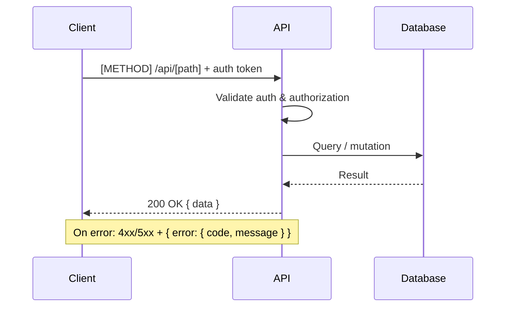
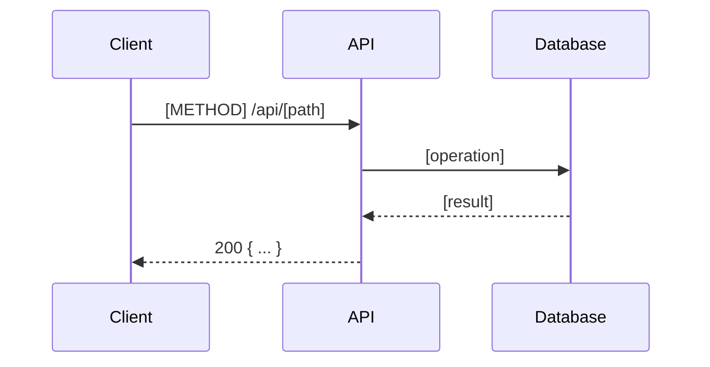

# 06 — API Contract

> Status: Draft — fill this before Phase 1 begins.

## Purpose

Define the API surface: endpoints, request/response shapes, authentication requirements, error codes, and versioning strategy. This doc is the contract between frontend and backend.

---

## API style

<!-- REST / tRPC / GraphQL / Server Actions / other. ADR reference: -->

## Authentication

<!-- How are requests authenticated? Bearer token, session cookie, other? -->

## Versioning

<!-- How is the API versioned? How are breaking changes handled? -->

---

## Endpoint overview


_Generic request/response flow — replace with endpoint-specific diagrams as the API is defined._

## Endpoints

### `[METHOD] /api/[path]`

**Purpose:**
**Authentication required:** Yes / No
**Authorization:** [who can call this]



**Request:**
```json
{
}
```

**Response (success):**
```json
{
}
```

**Response (errors):**
| Status | Code | Meaning |
|---|---|---|
| 400 | | |
| 401 | | |
| 403 | | |
| 404 | | |
| 500 | | |

---

## Common error format

```json
{
  "error": {
    "code": "string",
    "message": "string"
  }
}
```

## Rate limiting

<!-- Any rate limits? Per user, per IP, per endpoint? -->

## Related docs

- `01-user-flows.md`
- `02-domain-model.md`
- `04-security-threat-model.md`
