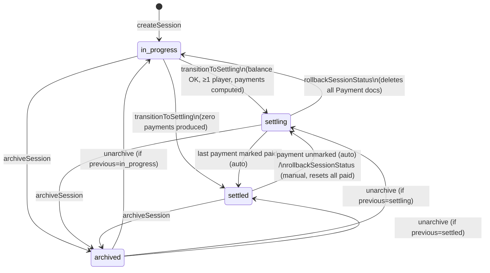

# 07 — Business Logic

> Status: Draft — fill this before Phase 1 begins.

## Purpose

Document the business rules that govern system behavior. These rules should be expressible as tests. They are the authoritative source for TDD.

---

## Rule format

> **Rule:** [name]
> **Description:** [what it enforces]
> **When violated:** [what happens — error, silent correction, audit log, etc.]
> **Tests required:** Yes

---

## State transition matrix

This is the canonical source of truth for session state transitions. All other docs and code must conform to this table.

| From → To | Trigger | Allowed? | Side effects | Error if denied |
|---|---|---|---|---|
| `in_progress` → `settling` | `transitionToSettling` action | Yes (if 2% balance rule + ≥1 player + all cash-outs set) | Compute settlement, write Payment docs, write changelog `status_changed` | `BALANCE_OUT_OF_RANGE`, `INVALID_INPUT`, or `INVALID_STATE_TRANSITION` |
| `in_progress` → `settled` | `transitionToSettling` produces zero Payments | Yes | Skip `settling`, transition straight to `settled` in same transaction; write changelog `status_changed` (single entry, `from: in_progress, to: settled`) | n/a |
| `in_progress` → `archived` | `archiveSession` | Yes | Set `previous_status = "in_progress"`, write changelog `session_archived` | n/a |
| `settling` → `in_progress` | `rollbackSessionStatus` | Yes | Delete all Payment docs in the session (not soft-flagged); write changelog `status_changed` | `INVALID_STATE_TRANSITION` |
| `settling` → `settled` | Last unpaid Payment marked paid | Yes (auto) | Same transaction as the payment write; write changelog `status_changed` | n/a |
| `settling` → `archived` | `archiveSession` | Yes | Set `previous_status = "settling"`; Payment docs are retained as-is; write changelog `session_archived` | n/a |
| `settled` → `settling` (auto) | Any Payment unmarked | Yes (auto) | Same transaction as the unmark; write changelog `status_changed` (`reason: "payment_unmarked"`) | n/a |
| `settled` → `settling` (manual) | `rollbackSessionStatus` | Yes | Reset every Payment's `paid`/`paid_at`/`paid_by_uid` to false/null in the same transaction; write changelog `status_changed` (`reason: "manual_rollback"`) | `INVALID_STATE_TRANSITION` |
| `settled` → `archived` | `archiveSession` | Yes | Set `previous_status = "settled"`; Payment docs (all paid) retained as-is; write changelog `session_archived` | n/a |
| `archived` → `previous_status` | `unarchiveSession` | Yes (if `previous_status` is non-null and a valid session state) | Restore `status = previous_status`; clear `previous_status`; write changelog `session_unarchived` | `INVALID_STATE_TRANSITION` if `previous_status` missing or invalid |
| `archived` → `archived` | `archiveSession` | **No** | n/a | `INVALID_STATE_TRANSITION` |
| Any other transition | n/a | **No** | n/a | `INVALID_STATE_TRANSITION` |


_State transition diagram — must match the matrix above._

---

## Rules by domain area

### Session lifecycle

> **Rule:** valid-state-transitions
> **Description:** Sessions follow the state machine defined in the **State transition matrix** above. No other transitions are permitted.
> **When violated:** Server returns 400 with code `INVALID_STATE_TRANSITION`
> **Tests required:** Yes — exhaustive test of every (from, to) pair, including denied transitions

> **Rule:** settling-requires-balance
> **Description:** A session cannot transition to `settling` unless both conditions hold:
> 1. `total_cashout <= total_buyin` (cash-outs can never exceed buy-ins)
> 2. `(total_buyin - total_cashout) / total_buyin <= 0.02` (shortfall is at most 2%)
>
> In other words, total cash-outs must fall in the range `[0.98 × total_buyin, total_buyin]`. If `total_buyin` is zero, the transition is blocked unconditionally with `BALANCE_OUT_OF_RANGE`. The 2% tolerance accounts for real-world chip loss.
> **When violated:** Transition rejected with code `BALANCE_OUT_OF_RANGE`; delta is surfaced in the settling modal
> **Tests required:** Yes — boundary conditions at exactly 0%, 1.99%, 2.00%, 2.01% shortfall; overage case; total_buyin = 0 case

> **Rule:** settling-requires-all-cashouts
> **Description:** Every player in the session must have a cash-out amount set (non-null) before the session can transition to `settling`. Cash-out of `0` cents is valid (the player busted out); only `null` blocks the transition. Cash-outs may be entered in the settling confirmation modal (prefilled with any prior table values). The server enforces this on the transition call regardless of how cash-outs were entered.
> **When violated:** Transition rejected with code `INVALID_INPUT`; the modal highlights missing fields
> **Tests required:** Yes

> **Rule:** no-buyin-changes-while-settling
> **Description:** Once a session is in `settling` or `settled` state, no new buy-ins can be added and no existing buy-ins can be removed or modified.
> **When violated:** Server returns 400 with code `SESSION_NOT_EDITABLE`
> **Tests required:** Yes

> **Rule:** cashout-edits-only-via-rollback-once-settling
> **Description:** Once the session is `settling` or `settled`, cash-out values are locked. To change a cash-out, the user must first roll back to `in_progress` (which deletes existing Payment docs). This avoids the bug where editing a cash-out while `settling` would silently desynchronize Payment records from the player table totals.
> **When violated:** Server returns 400 with code `SESSION_NOT_EDITABLE` if the client attempts `setCashOut` on a non-`in_progress` session.
> **Tests required:** Yes — verify `setCashOut` is rejected in `settling`, `settled`, and `archived`. (Note: this supersedes earlier drafts that allowed cash-out edits during `settling`.)

> **Rule:** archive-is-soft-delete
> **Description:** Archiving a session moves it to `archived` state and stores the previous state in `previous_status`. No data is hard-deleted. Archived sessions are hidden from the main index but visible in the Archived section of the side menu and reachable via search. Archive is available from any non-archived state.
> **When violated:** Attempt to archive an already-archived session is rejected with `INVALID_STATE_TRANSITION`.
> **Tests required:** Yes

> **Rule:** unarchive-restores-previous-status
> **Description:** Unarchive restores the session to its `previous_status` (one of `in_progress`, `settling`, `settled`). On unarchive, `previous_status` is cleared. If `previous_status` is null or not a valid recoverable state (data corruption), the unarchive is rejected.
> **When violated:** Server returns 400 with code `INVALID_STATE_TRANSITION`.
> **Tests required:** Yes — including the "missing/invalid previous_status" case

> **Rule:** rollback-from-settling-deletes-payments
> **Description:** Rolling back `settling → in_progress` deletes every Payment document in the session's `payments` subcollection in the same transaction. This is the single source of truth for "no orphaned Payment docs after rollback." A new settlement is computed fresh on next transition to `settling`.
> **When violated:** Programming error — the action is atomic.
> **Tests required:** Yes — verify Payment subcollection is empty after rollback, including when some Payments were already paid.

> **Rule:** rollback-from-settled-resets-paid-marks
> **Description:** Rolling back `settled → settling` (manual) iterates every Payment in the session and resets `paid = false`, `paid_at = null`, `paid_by_uid = null` in the same transaction. A single changelog entry `status_changed` (`reason: "manual_rollback"`) is written; individual `payment_unmarked_paid` entries are NOT written for the cascade reset.
> **When violated:** Programming error — the action is atomic.
> **Tests required:** Yes — verify all paid marks reset and exactly one changelog entry written

---

### Payments

> **Rule:** auto-settle-on-last-payment
> **Description:** When the last unpaid payment in a `settling` session is marked paid, the session immediately and automatically transitions to `settled` in the same transaction. No user confirmation is required. Two changelog entries are written: `payment_marked_paid` followed by `status_changed`.
> **When violated:** n/a — system invariant enforced on every payment write
> **Tests required:** Yes

> **Rule:** auto-unsettle-on-payment-unmark
> **Description:** Payments can be un-marked (toggled from paid back to unpaid) at any time while the session is `settling` or `settled`. If the session is `settled` when a payment is un-marked, the session immediately and automatically transitions back to `settling` in the same transaction. The un-marked payment's `paid`, `paid_at`, and `paid_by_uid` fields are cleared. Two changelog entries are written: `payment_unmarked_paid` followed by `status_changed` (with `reason: "payment_unmarked"`).
> **When violated:** n/a — system invariant enforced on every payment unmark write
> **Tests required:** Yes

> **Rule:** auto-unsettle-skips-balance-check
> **Description:** When a session auto-transitions `settled → settling` because a payment was unmarked, the 2% balance check is NOT re-run — the buy-in/cash-out data is unchanged from when the session was originally moved to `settling`, so the balance is still valid by construction.
> **When violated:** n/a
> **Tests required:** Yes — verify auto-unsettle succeeds even when a hypothetical balance check would fail (it can't, but the test asserts no check is invoked)

> **Rule:** payment-mark-idempotent
> **Description:** Marking a payment paid when it is already paid is a no-op (no error, no duplicate changelog entry). Same for unmarking an already-unpaid payment.
> **When violated:** n/a — idempotent
> **Tests required:** Yes

---

### Buy-ins

> **Rule:** buyin-positive
> **Description:** A buy-in amount must be a positive integer in cents. Zero and negative amounts are rejected. Maximum amount is `2_000_000` cents ($20,000) — sanity ceiling to catch typos like an extra zero.
> **When violated:** Server returns 400 with code `INVALID_AMOUNT`
> **Tests required:** Yes

---

### Cash-outs

> **Rule:** cashout-non-negative
> **Description:** A cash-out amount must be zero or a positive integer in cents. Negative values are rejected. The same `2_000_000` cents ceiling applies. Setting cash-out to `null` (clearing it) is allowed only while `in_progress`.
> **When violated:** Server returns 400 with code `INVALID_AMOUNT`
> **Tests required:** Yes

---

### Currency input parsing (UI → server)

> **Rule:** currency-input-parsing
> **Description:** The UI converts user-entered dollar strings to integer cents before invoking a Server Action.
>
> **Accepted formats** (validated by regex `^\$?\s*(\d+)(?:[.,](\d{1,2}))?\s*$`):
> - `25` → 2500 cents
> - `$25` → 2500 cents
> - `25.5` → 2550 cents
> - `25.50` → 2550 cents
> - `0.25` → 25 cents
> - `.25` → **rejected** (must have leading digit)
>
> **Rejected:**
> - More than 2 decimal places (`0.255`)
> - Negative values (`-5`)
> - Empty/whitespace-only
> - Thousands separators (`1,000.00`) — keep parser simple; rely on the cents ceiling
> - Locale variants (`,` decimal): not supported in MVP — English-only
>
> **Implementation:** lives in `src/lib/currency/parse.ts`. Pure function `parseDollars(input: string): number | null` returns cents or `null` for invalid input. Tested exhaustively.
> **When violated:** UI shows inline validation error; the action is not invoked.
> **Tests required:** Yes — every accepted/rejected case above

> **Rule:** currency-display-formatting
> **Description:** Cents are displayed as USD currency. Implementation: `formatCents(n: number): string` returns `Intl.NumberFormat("en-US", { style: "currency", currency: "USD" }).format(n / 100)`. Negative net values render with leading `-` (e.g., `-$25.00`). Lives in `src/lib/currency/format.ts`.
> **When violated:** n/a — pure formatting function
> **Tests required:** Yes — positive, zero, negative, large values

---

### Settlement calculation

> **Rule:** shortfall-absorption-before-settlement
> **Description:** When `total_cashout < total_buyin` (within the 2% tolerance), the shortfall must be absorbed before computing net balances; otherwise the greedy algorithm produces overpayments. Absorption rule: scale **debtor losses** down proportionally so that `sum(net) = 0` exactly.
>
> **Algorithm (in integer cents):**
> 1. Compute raw `net[i] = cashout[i] - sum(buyins[i])` for every player.
> 2. Compute `shortfall = total_buyin - total_cashout` (≥ 0, ≤ 2% × total_buyin).
> 3. Compute `total_debt = sum(-net[i] for net[i] < 0)` (always ≥ shortfall).
> 4. For each debtor (`net[i] < 0`), reduce their debt: `net[i] += round((-net[i] / total_debt) * shortfall)` — i.e., absorb a proportional share of the shortfall.
> 5. **Rounding remainder fix:** after step 4 the cents may not sum to zero by ±1 cent due to rounding. Distribute remaining cents one at a time (smallest absolute value first; ties broken by player creation timestamp ASC, then player ID ASC) until `sum(net) === 0` exactly.
> 6. Pass the adjusted `net` array to the greedy matcher.
>
> **Why scale debts (not credits)?** The shortfall represents physical chip loss — money that was bought in but never cashed out. The "missing" money came out of debtor pockets too (they bought in chips that got lost), so creditors are owed the full amount that was cashed out. Reducing debt is the correct semantic.
> **When violated:** Programming error — the algorithm guarantees `sum(net) = 0` after this step.
> **Tests required:** Yes — worked example below; boundary cases (exact 2% shortfall, single-cent remainder, all-debtor or all-creditor edge case)
>
> **Worked example:**
> - Players: A bought in $100 (10000¢), cashed out $0; B bought in $100 (10000¢), cashed out $198 (19800¢).
> - Total buy-in: 20000¢; total cash-out: 19800¢; shortfall: 200¢ (1%, within tolerance).
> - Raw net: A = -10000, B = +9800. Sum = -200 (≠ 0).
> - Total debt: 10000. A's share of shortfall: round((10000/10000) × 200) = 200.
> - Adjusted A: -10000 + 200 = -9800. Adjusted B: +9800. Sum = 0. ✓
> - Greedy match: A → B for 9800¢ ($98.00). One transaction.

> **Rule:** minimum-transactions-algorithm
> **Description:** After shortfall absorption, settle-up transactions are computed by greedy net-balance matching. This produces the minimum number of transactions for any given set of zero-sum net balances (proof: each iteration zeroes at least one player, so transactions ≤ players − 1).
>
> **Algorithm:**
> 1. Separate players into creditors (net > 0) and debtors (net < 0). Players with net = 0 are excluded.
> 2. Sort creditors descending by net; sort debtors descending by `-net` (largest debt first). **Tie-break: player `created_at` ASC, then player document ID ASC** (deterministic for tests).
> 3. Loop: take the largest debtor D and largest creditor C. Create a Payment document `{from: D, to: C, amount: min(-net[D], net[C])}`. Subtract that amount from both balances. Drop any player whose balance reaches zero. Repeat until both lists empty.
>
> **Edge cases:**
> - Empty player list → zero Payments → session transitions straight to `settled` (see "in_progress → settled" row in the matrix).
> - All players net-zero → zero Payments → same path as above.
> - Single player → zero Payments (sum is zero by construction) → same path.
> - Zero shortfall → step 4 of absorption is a no-op; algorithm proceeds.
>
> **When violated:** Programming error — `sum(net) = 0` is the precondition; bugs here corrupt money.
> **Tests required:** **Highest-value TDD target.** Test: 2-player even, 2-player uneven, 3-player chain (A owes B, B owes C resolves to A→C+A→B), 5-player ring, all-zero, single creditor + multiple debtors, with-shortfall, zero-shortfall, ties.

> **Rule:** settlement-sum-to-zero
> **Description:** After applying shortfall absorption, the sum of all net balances is exactly zero (in integer cents). The settlement algorithm relies on this precondition.
> **When violated:** Programming error — assert as a precondition in code; throw `INTERNAL_ERROR` if violated.
> **Tests required:** Yes — property test on randomly generated inputs

---

### Session naming

> **Rule:** session-name-format
> **Description:** Session names are generated server-side in the format `[food-word]-[food-word]-[NNN]` where NNN is a zero-padded random three-digit number (000–999). Both words are drawn independently with replacement (so `bacon-bacon-042` is a valid name). Names are lowercase, hyphen-separated. Examples: `bacon-mango-042`, `lemon-rice-117`, `bacon-bacon-000`.
>
> **Implementation:** `generateSessionName(rng?: () => number): string` in `src/lib/sessions/name.ts`. The optional `rng` parameter (default: `Math.random`) makes the function deterministically testable. RNG is collision-domain only (not security-sensitive) — `Math.random` is fine.
> **When violated:** n/a — names are generated, not user-supplied
> **Tests required:** Yes — format validation; deterministic test with stubbed RNG; verify both words can be the same

> **Rule:** session-name-unique
> **Description:** Session names must be globally unique (they serve as the URL key). On creation, if the generated name is already taken, a new name is generated and retried (up to 5 attempts). Uniqueness is enforced via a Firestore transaction: read the candidate document by ID; if it exists, retry; if not, write atomically.
> **When violated:** After 5 failed attempts, session creation fails with code `NAME_COLLISION`. With ~73 words, the keyspace is `73 × 73 × 1000 ≈ 5.3M` combinations — collision probability per attempt is < 0.0001% at 50 sessions.
> **Tests required:** Yes — unit test with a mocked existence check that returns "taken" twice then "free"

**Food word list** (easy-to-spell, easy-to-say-aloud):

```
apple, bacon, bagel, banana, bean, beef, beet, bread, butter,
cake, candy, carrot, celery, cherry, chicken, clam, cocoa, corn,
crab, cream, curry, date, duck, egg, fig, fish, fudge, grape,
guava, ham, honey, jam, kale, kiwi, lamb, leek, lemon, lime,
lobster, mango, maple, melon, mint, muffin, noodle, oat, olive,
onion, orange, pasta, peach, pear, pea, pie, pizza, plum, pork,
potato, radish, rice, roll, rye, sage, salsa, shrimp, steak,
taco, toast, tuna, turkey, turnip, waffle, walnut, yam
```

73 words — count is the source of truth for the keyspace calculation in `04-security-threat-model.md`. The list lives as a hardcoded array in `src/lib/sessions/name.ts`.

---

### Players

> **Rule:** player-name-required
> **Description:** A player must have a non-empty name. Maximum 50 characters. Leading and trailing whitespace is stripped server-side before storage.
> **When violated:** Server returns 400 with code `INVALID_PLAYER_NAME`
> **Tests required:** Yes

> **Rule:** player-name-unique-within-session
> **Description:** Player names must be unique within a session (case-insensitive comparison after trimming). Applies on both create and rename. Implementation: a denormalized `name_lower: string` field is written on every player create/rename; uniqueness is checked via a Firestore equality query inside the transaction (`.where("name_lower", "==", lowercase) → .limit(1)`).
> **When violated:** Server returns 400 with code `DUPLICATE_PLAYER_NAME`
> **Tests required:** Yes — same name with different casing; rename collision

> **Rule:** player-name-editable
> **Description:** A player's name can be updated at any time while the session is not `archived`. Renaming does not affect buy-ins, cash-out, or payment records (which reference player document ID). Existing changelog entries are NOT rewritten — they are immutable snapshots and continue to display the player's prior name. Future changelog entries use the new name.
> **When violated:** Server returns 400 with code `SESSION_NOT_EDITABLE` if session is `archived`
> **Tests required:** Yes — including "old changelog entries retain old name" assertion

---

## Authorization rules

Auth model: **Google Sign-In required for all access — reads and mutations alike.** See `docs/04-security-threat-model.md` for the canonical auth flow. Brief summary:

- **Next.js proxy** (`src/proxy.ts`, formerly known as middleware): checks for the presence of the `session` cookie. Unauthenticated requests redirect to `/sign-in`. The proxy does NOT cryptographically verify the cookie — verification happens in Server Actions and at the layout level.
- **App layout** (`src/app/(app)/layout.tsx`): the RSC calls `adminAuth.verifySessionCookie(cookie)` once per request. Failure → redirect to sign-in. This protects every read path.
- **Server Actions** (mutations): each action receives a fresh Firebase ID token (obtained client-side via `auth.currentUser.getIdToken()`) and verifies it via `adminAuth.verifyIdToken(token)`. The session cookie alone is NOT sufficient for mutations.
- **Firestore Security Rules**: `request.auth != null` for reads; writes are denied to all clients (writes go through the Admin SDK in Server Actions, which bypass rules).

Players are name strings — they have no auth identity. Any signed-in user may act on behalf of any player.

| Action | Allowed for | Denied for | Notes |
|---|---|---|---|
| View session / index / search | Any signed-in user | Unauthenticated | Unauthenticated users redirected to sign in; search includes all sessions including archived |
| Create session | Any signed-in user | Unauthenticated | |
| Add player | Any signed-in user | Unauthenticated; session not `in_progress` | |
| Rename player | Any signed-in user | Unauthenticated; session `archived` | Allowed in all non-archived states |
| Add buy-in | Any signed-in user | Unauthenticated; session not `in_progress` | |
| Remove buy-in | Any signed-in user | Unauthenticated; session not `in_progress` | |
| Set cash-out | Any signed-in user | Unauthenticated; session not `in_progress` | Cash-out edits during `settling` are NOT allowed (must rollback first) — see `cashout-edits-only-via-rollback-once-settling` |
| Move to settling | Any signed-in user | Unauthenticated; validation fails in modal | Balance and cashout constraints enforced server-side |
| Mark payment paid | Any signed-in user | Unauthenticated; session not `settling` or `settled` | Idempotent |
| Unmark payment | Any signed-in user | Unauthenticated; session not `settling` or `settled` | Auto-transitions `settled→settling` if in settled state |
| Rollback to in_progress | Any signed-in user | Unauthenticated; session not `settling` | Deletes all Payment docs |
| Rollback to settling | Any signed-in user | Unauthenticated; session not `settled` | Resets all payment paid marks |
| Archive session | Any signed-in user | Unauthenticated; already `archived` | Soft delete; stores `previous_status` |
| Unarchive session | Any signed-in user | Unauthenticated; session not `archived`; `previous_status` invalid | Restores to `previous_status` |

---

## Concurrency and optimistic locking

Multiple signed-in users can edit the same session simultaneously. Without precautions this leads to lost-update bugs. The defense:

> **Rule:** transition-to-settling-uses-firestore-transaction
> **Description:** `transitionToSettling` runs inside a Firestore transaction. The transaction reads the session doc, all players, and all buy-ins inside the transaction; computes totals server-side; validates the balance rule; computes settlement; writes Payment docs and updates `Session.status`. If any read document changes between the transaction's start and commit, Firestore retries automatically (up to 5 times, then throws). The action surfaces the retry-exhausted error as `SESSION_DATA_STALE`.
> **When violated:** n/a — Firestore enforces transactional read consistency.
> **Tests required:** Yes — emulator-based concurrency test (two parallel transitions; one should win, the other returns `SESSION_DATA_STALE` or sees the post-state).

> **Rule:** payment-writes-use-firestore-transaction
> **Description:** `markPaymentPaid` and `unmarkPayment` run inside a Firestore transaction that reads the session and the target Payment, writes the Payment update, evaluates auto-(un)settle, and conditionally updates `Session.status` — all atomically. If two users mark the last unpaid Payment simultaneously, only one transaction succeeds; the other retries and sees the session is already `settled` (no-op via idempotency).
> **When violated:** n/a
> **Tests required:** Yes — emulator-based concurrency test

> **Rule:** other-mutations-use-batched-writes
> **Description:** All other mutations (`addBuyIn`, `addPlayer`, `setCashOut`, `archiveSession`, etc.) use Firestore **batched writes** for atomicity of the primary write + changelog entry, but do NOT need transactions because they don't depend on cross-document consistency. The session document's `updated_at` is set by every mutation.
> **When violated:** n/a
> **Tests required:** Verify changelog entry exists for every mutation type

---

## Calculation and transformation rules

- **Currency**: all amounts stored as non-negative integers in cents (e.g., $0.25 = `25`, $10.00 = `1000`). No floating-point arithmetic on monetary values. Supports quarter-dollar games.
- **Rounding**: display layer divides cents by 100 and formats as currency (`$0.25`, `$10.00`). All server-side calculations done in integer cents. Where rounding is required (shortfall absorption), use `Math.round` and document a residual-correction step.
- **2% rule**: valid range for total cash-outs is `[0.98 × total_buyin, total_buyin]`. Cash-outs can fall short by up to 2% (chip loss tolerance) but can never exceed total buy-ins.

---

## Changelog rules

Every write operation that changes session or player state must produce a `ChangeLogEntry`. This is system-enforced — no mutation is complete without its log entry.

> **Rule:** changelog-on-every-mutation
> **Description:** Every state-changing write creates exactly one `ChangeLogEntry` (except where the State transition matrix calls for two — see auto-settle, auto-unsettle, manual rollback, etc.). Entry fields: `actor_uid`, `actor_name`, `action_type`, `description`, `metadata` (optional structured object), `created_at`. The actor's first name is derived from `displayName.split(' ')[0]`. If `displayName` is missing or empty, fall back to the literal string `"Anonymous"` — never the email or UID.
> **When violated:** n/a — changelog write is atomic with the primary write (same batch or transaction)
> **Tests required:** Yes — verify log entries are created for each `action_type` and the `actor_name` fallback

> **Rule:** changelog-action-types
> **Description:** The `action_type` enum is exactly the following set; no other values are allowed:
>
> - `session_created`
> - `player_added`
> - `player_renamed`
> - `buy_in_added`
> - `buy_in_removed`
> - `cash_out_set` (covers setting and clearing; clearing carries `metadata.cleared = true`)
> - `status_changed` (carries `metadata.from`, `metadata.to`, optional `metadata.reason` ∈ {`payment_marked`, `payment_unmarked`, `manual_rollback`, `auto_settle_zero_payments`})
> - `payment_marked_paid`
> - `payment_unmarked_paid`
> - `session_archived`
> - `session_unarchived`
>
> **When violated:** Server rejects with `INTERNAL_ERROR`.
> **Tests required:** Yes — type test in `src/lib/changelog/types.ts`

> **Rule:** changelog-immutable
> **Description:** `ChangeLogEntry` records are append-only. They cannot be edited or deleted (even when the session is archived). Player rename does not rewrite past entries.
> **When violated:** Server rejects any attempt to modify or delete a log entry; Firestore rules deny client writes to the `change_log` subcollection.
> **Tests required:** Yes

> **Rule:** changelog-description-template
> **Description:** The `description` field is a human-readable English string generated server-side at write time. To support bolding monetary amounts in the UI without parsing free text, descriptions follow a strict template:
>
> > `[actor] [verb phrase] [optional: $amount] [optional: for/from/to player_name].`
>
> Monetary values are always formatted via `formatCents()` and surrounded by `**` markers (e.g., `Michi added **$50.00** buy-in for Billy.`). The activity log component renders `**...**` substrings as `<strong>...</strong>`. No other markdown is supported. This is the simplest correct way to bold amounts without a structured payload.
>
> **When violated:** Programming error — descriptions without `**` for amounts will simply not be bolded.
> **Tests required:** Yes — description format for each `action_type`

---

## Edge cases and invariants

- A session with zero players cannot transition to `settling` (server returns `INVALID_INPUT`).
- A session whose computed settlement produces zero Payments transitions directly from `in_progress → settled` (skipping `settling`). See the matrix.
- A player with no buy-ins and no cash-out has a net balance of zero — they are excluded from settlement.
- A player with no buy-ins but a cash-out set is a net creditor (unusual but valid).
- A player can owe money to multiple creditors — the algorithm may produce multiple outgoing payments for one debtor.
- Rollback `settling → in_progress` deletes Payment docs. Rollback `settled → settling` (manual) keeps them and resets paid marks.
- Auto-unsettle (`settled → settling` via unmark): only the un-marked payment changes; all others retain paid status.
- `actor_name` is always non-empty (`"Anonymous"` fallback) so the activity log never shows a blank author.

## Related docs

- `02-domain-model.md`
- `04-security-threat-model.md`
- `06-api-contract.md`
- `09-test-strategy.md`
