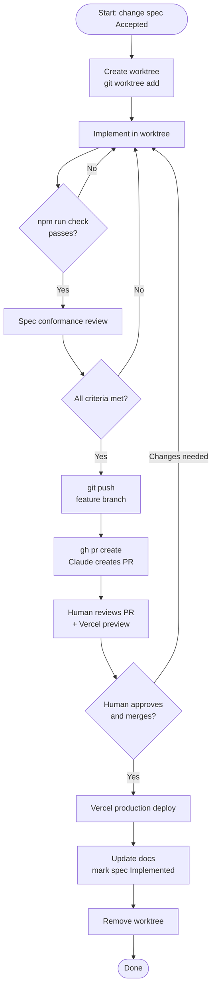

# 13 — Development Lifecycle

> This doc defines the practical, day-to-day development workflow for this project.

---

## Lifecycle overview


_End-to-end lifecycle — Claude creates the PR; the human merges._

---

## Local branch workflow (no worktrees)

For very small changes (docs, typo fixes):

```sh
git checkout main
git pull
git checkout -b docs/update-readme
# make changes
git add .
git commit -m "Update README with setup instructions"
git push -u origin docs/update-readme
# open PR, review, merge
git checkout main && git pull
git branch -d docs/update-readme
```

---

## Worktree workflow (standard)

For all implementation work, use isolated worktrees. This keeps `main` clean and allows multiple parallel workstreams.

### Setup

```sh
git checkout main
git pull
mkdir -p ../worktrees
git worktree add ../worktrees/poker-ledger-0001 -b feature/0001-nextjs-shell main
cd ../worktrees/poker-ledger-0001
```

### During development

Work entirely inside the worktree directory. Claude Code should be invoked from within the worktree.

```sh
# verify you are in the right place
git worktree list
git branch --show-current

# after making changes
git status
npm run check
git add .
git commit -m "Add meaningful description of change"
```

### Finishing and pushing

```sh
git status                                        # confirm clean or expected state
npm run check                                     # all gates must pass
git add <specific files>
git commit -m "Describe the change"
git push -u origin feature/0001-nextjs-shell     # triggers Vercel preview
```

### Creating a PR

After pushing, Claude Code creates the PR with the GitHub CLI:

```sh
gh pr create \
  --base main \
  --head feature/0001-nextjs-shell \
  --title "Describe the change" \
  --body-file /tmp/pr-body.md
```

Claude reports the PR URL. **Claude does not merge the PR.** The human reviews, checks the Vercel preview, and merges.

### After PR is merged (by human)

```sh
cd <main-repo-path>
git checkout main
git pull
git worktree remove ../worktrees/poker-ledger-0001
git branch -d feature/0001-nextjs-shell
```

---

## Preview deployment workflow

1. Push a feature branch to GitHub.
2. Vercel automatically creates a preview deployment.
3. Review the preview URL (visible in GitHub PR and Vercel dashboard).
4. Preview deployments use Vercel's preview environment variables.
5. Preview is a manual review step — it does not replace local deterministic gates.

---

## Production deployment workflow

1. All deterministic gates pass locally (`npm run check`).
2. Claude creates PR with `gh pr create`. Claude reports the PR URL.
3. Human reviews PR and Vercel preview deployment.
4. **Human merges PR to `main`.** Claude does not merge.
5. Vercel automatically deploys to production.
6. Verify production deployment in Vercel dashboard.
7. Run post-deploy smoke test.

---

## When to use the Vercel CLI

**Use it for:**
- Linking a project (`vercel link`)
- Pulling environment variables locally (`vercel env pull`)
- Inspecting recent deployments (`vercel ls`)
- Tailing logs for debugging (`vercel logs`)

**Do not use it for:**
- Normal production deploys (use GitHub → Vercel auto-deploy)
- Environment variable management in CI (use `vercel env` + GitHub Actions)

---

## Environment variable relationships

| Variable source | Used where | Example |
|---|---|---|
| `.env.local` | Local development only | `DATABASE_URL=postgres://localhost/...` |
| `.env.example` | Documentation (committed, no secrets) | `DATABASE_URL=` |
| Vercel env (preview) | Vercel preview deployments | Set via `vercel env add ... preview` |
| Vercel env (production) | Vercel production deployments | Set via `vercel env add ... production` |

**Rules:**
- `.env.local` is never committed.
- `.env.example` is always committed and always current.
- Every required variable must be in `.env.example`.
- New variables introduced in a change spec must be added to `.env.example` and documented.

---

## Recovering if Claude Code makes too broad a change

If Claude has made changes that are too wide in scope:

1. **Do not commit.** Run `git diff` to see what changed.
2. **Identify the overreach.** What went beyond the accepted change spec?
3. **Restore selectively.** Use `git checkout -- <file>` to restore specific files, or `git restore --staged <file>` to unstage.
4. **Discuss the overreach.** Decide whether the extra changes are acceptable (update the spec) or should be discarded.
5. **If in doubt, reset the worktree:**

```sh
git status
git stash                      # save current changes temporarily
git stash show -p              # inspect what was stashed
git stash drop                 # discard if overreach confirmed
```

---

## Worktree recovery

```sh
git worktree list                          # see all active worktrees
git worktree prune                         # clean up metadata for deleted paths
git worktree remove --force <path>         # force-remove a stale worktree
git branch -D feature/abandoned-branch    # delete a local branch (use with care)
```

---

## Related docs

- `15-local-development.md`
- `16-quality-gates.md`
- `17-worktree-workflow.md`
- `14-release-process.md`
