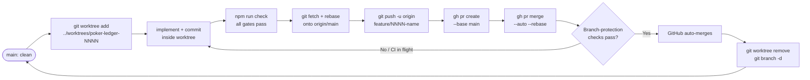

# 17 — Worktree Workflow

> This doc defines the Git worktree-based development lifecycle for this project.

---

## Worktree lifecycle diagram


_Worktree lifecycle — Claude creates the PR and enables auto-merge; GitHub merges once branch-protection checks pass._

---

## Why worktrees?

Git worktrees allow multiple branches to be checked out simultaneously in separate directories. This means:

- You can work on a feature without stashing or switching branches in the main repo.
- Claude Code can be run in isolation inside a specific worktree, reducing the risk of it touching the wrong files.
- Parallel work on multiple specs is possible without conflicts.
- The main repo directory always stays on `main`, which is clean and deployable.

---

## Creating a worktree

```sh
# Ensure main is up to date
git checkout main
git pull

# Create the worktrees directory if it doesn't exist
mkdir -p ../worktrees

# Create a new worktree with a new branch
git worktree add ../worktrees/poker-ledger-0001 -b feature/0001-nextjs-shell main

# Move into the worktree
cd ../worktrees/poker-ledger-0001
```

The branch name should match the spec number and a short slug:
- `feature/0001-nextjs-shell`
- `spec/0002-auth-model`
- `docs/mvp-scope`
- `fix/local-dev-env`
- `chore/update-quality-gates`

### Automatic dependency install

A new worktree gets its own `node_modules` (worktrees do not share them), so dependencies must be installed before `npm run dev` or the test suite will work. This is automated: a `post-checkout` git hook (declared in `lefthook.yml`, installed into the shared `.git/hooks` by `lefthook install`) runs `npm install` whenever a checkout lands in a directory with no `node_modules` — which is exactly the state of a freshly added worktree.

- It runs **synchronously**, so `git worktree add` (and Orca's "new worktree") blocks until install finishes; the worktree is ready when the command returns.
- Ordinary branch switches in an existing worktree already have `node_modules`, so the hook is a no-op and adds no latency. If a branch switch changes `package-lock.json`, run `npm install` yourself — the hook only bootstraps an empty worktree, it doesn't keep deps in sync.
- The trigger lives in the repo, not in any per-machine tool config, so it works for anyone who clones and installs once. An external setup trigger (e.g. Orca's per-repo setup command) is therefore unnecessary.
- Escape hatch: set `LEFTHOOK=0` to skip all git hooks, including this install.
- **npm-only.** The bootstrap install (and every install) must be npm. A separate per-machine trigger that runs `pnpm install` on a fresh worktree was observed re-resolving caret ranges and drifting `node_modules` (e.g. `@biomejs/biome` 2.4.14 → 2.5.0, breaking lint). A `preinstall` guard now aborts `pnpm`/`yarn`, and `lockfile-guard` flags a stray `pnpm-lock.yaml`/`yarn.lock` or Biome drift; recover with `npm ci`. See change spec `0029-package-manager-guard`.

See change spec `0025-worktree-bootstrap-hook` for the rationale.

---

## Running Claude Code in a worktree

Always `cd` into the worktree directory **before** starting Claude Code. Claude Code operates relative to the current working directory.

```sh
cd ../worktrees/poker-ledger-0001
claude   # or your Claude Code invocation
```

Verify you are in the right place:

```sh
git worktree list
git branch --show-current
pwd
```

**Never run Claude Code in the main repo directory while working on a feature branch.** This avoids accidental commits to `main`.

---

## Full end-to-end example

```sh
# 1. Start from clean main
git checkout main
git pull
mkdir -p ../worktrees
git worktree add ../worktrees/poker-ledger-0001 -b feature/0001-nextjs-shell main
cd ../worktrees/poker-ledger-0001

# 2. Make changes, then run gates
npm run check

# 3. Commit
git status
git add <specific files>
git commit -m "Initialize Next.js shell"

# 4. Rebase onto latest main, then push (triggers Vercel preview deployment)
git fetch origin && git rebase origin/main
git push -u origin feature/0001-nextjs-shell

# 5. Create PR + enable auto-merge (Claude Code does this)
gh pr create \
  --base main \
  --head feature/0001-nextjs-shell \
  --title "Initialize Next.js shell" \
  --body-file /tmp/pr-body.md
gh pr merge <number> --auto --rebase
# Claude reports the PR URL. GitHub merges once branch-protection checks pass.

# 6. After the PR merges, clean up
cd <absolute-path-to-main-repo>
git checkout main
git pull
git worktree remove ../worktrees/poker-ledger-0001
git branch -d feature/0001-nextjs-shell
```

---

## Committing and pushing from a worktree

```sh
git status
npm run check                                     # all gates must pass
git add <specific files>                          # prefer specific files over git add .
git commit -m "Clear description of the change"
git push -u origin feature/0001-nextjs-shell      # triggers Vercel preview
```

---

## Creating a PR from a worktree

After pushing, Claude Code creates the PR and enables auto-merge using the GitHub CLI:

```sh
git fetch origin && git rebase origin/main     # auto-merge is blocked if the branch is behind main
git push --force-with-lease                     # only if the rebase moved commits
gh pr create \
  --base main \
  --head feature/0001-nextjs-shell \
  --title "Describe the change" \
  --body-file /tmp/pr-body.md
gh pr merge <number> --auto --rebase            # defers the merge to branch-protection gates
```

**Claude enables auto-merge; it never force-merges or bypasses branch protection.** After creating the PR, Claude rebases onto the latest `origin/main` (auto-merge is blocked when the branch is behind a protected base), enables auto-merge with `gh pr merge --auto --rebase`, and reports the PR URL. GitHub merges once required checks (and any required reviews) pass. If a clean rebase isn't possible at PR time because CI or a dependency PR is still in flight, schedule a follow-up (`/schedule`) to rebase and enable auto-merge once it clears.

### PR body requirements

The PR body (`/tmp/pr-body.md`) must include:
- Linked change spec (or "scaffold-only / docs-only" if no spec)
- Summary of what changed and why
- Acceptance criteria (from the spec, or explicit for scaffold/docs changes)
- Gates run and their results
- Local development impact
- Deployment notes (env vars, migrations)
- Known limitations

### GitHub CLI setup

```sh
brew install gh
gh auth login
```

The GitHub CLI is not required for local development. It is required for Claude to create PRs. If it is not installed, Claude should prompt the user to install it.

---

## Finishing and removing a worktree

After the PR has merged:

```sh
# Return to the main repo
cd <absolute-path-to-main-repo>

# Ensure main is up to date
git checkout main
git pull

# Remove the worktree
git worktree remove ../worktrees/poker-ledger-0001

# Delete the local branch
git branch -d feature/0001-nextjs-shell
```

---

## Listing worktrees

```sh
git worktree list
```

Output shows each worktree, its path, and the branch it is on.

---

## Pruning stale worktrees

If a worktree directory was deleted manually without using `git worktree remove`, clean up the metadata:

```sh
git worktree prune
```

---

## Force-removing a worktree

If a worktree has uncommitted changes you want to discard, or the path no longer exists:

```sh
git worktree remove --force ../worktrees/poker-ledger-0001
```

---

## Avoiding worktree confusion

- Always use absolute paths or verify with `pwd` before running commands.
- Run `git worktree list` if you are unsure which directory maps to which branch.
- Do not open the main repo and a worktree in the same IDE session without clearly labeling them.
- Name worktree directories to match the spec number (e.g., `poker-ledger-0001`) — this maps to the branch name and change spec.
- Each worktree allocates its own dev ports on first `npm run dev` and persists the offset to `.devports` (gitignored). The startup banner — e.g. `Worktree dev ports — offset +500 — Next 3500, UI 4500, Firestore 8580, Auth 9599` — is the quickest way to confirm which terminal window belongs to which worktree. See `docs/15-local-development.md` for the full mechanism.

---

## Related docs

- `13-dev-lifecycle.md`
- `14-release-process.md`
- `16-quality-gates.md`
